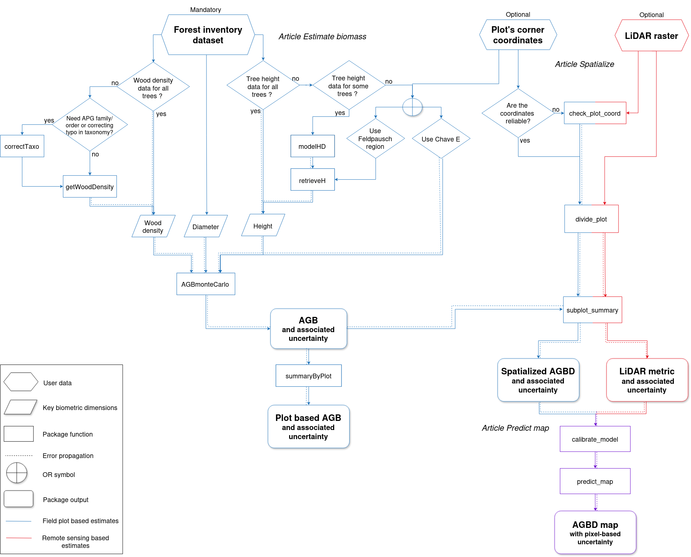

BIOMASS
================

[](https://github.com/umr-amap/BIOMASS/actions/workflows/test-coverage.yml)
[](https://github.com/umr-amap/BIOMASS/actions/workflows/check-standard.yml)
[](https://github.com/umr-amap/BIOMASS/actions/workflows/pkgdown.yaml)


## The package

The `BIOMASS` package allows users to estimate above ground biomass/carbon and its uncertainty in tropical forests. 

The main implemented steps are as follows :

1.  retrieving and correcting tree taxonomy;
2.  estimating wood density and its uncertainty;
3.  building height-diameter models;
4.  estimating above ground biomass/carbon at stand level with associated uncertainty;
5.  managing tree and plot coordinates;
6.  predicting landscape maps of AGBD with associated uncertainties using LiDAR products.

For more information, see [Réjou-Méchain et al. (2017)](https://besjournals.onlinelibrary.wiley.com/doi/10.1111/2041-210X.12753)

## Install BIOMASS

The latest released version from CRAN:

``` r
install.packages("BIOMASS")
```

The latest version from Github (in development):

``` r
install.packages("remotes")
remotes::install_github('umr-amap/BIOMASS')
```

To use it :

``` r
library("BIOMASS")
```

## Tutorials/Vignettes

Three vignettes are available in the 'Articles' section of the following page : [https://umr-amap.github.io/BIOMASS/index.html](https://umr-amap.github.io/BIOMASS/index.html)
For the sake of clarity, and to be consistent with the BIOMASS paper ([Réjou-Méchain et al. 2017](https://besjournals.onlinelibrary.wiley.com/doi/10.1111/2041-210X.12753)), the three articles comprised in the vignette follow the same workflow as presented in the paper:



The first vignette (Estimate stand biomass) is dedicated to compute above ground biomass (AGB) and its associated uncertainty from plot inventory data. 
The second one (Spatialize trees and forest stand metrics) explains how to manage plot coordinates and summarize AGB and/or LiDAR metrics at subplot level. 
The third one (Predict maps of AGBD based on inventory and LiDAR data) guides the user through the last steps of the workflow to get AGBD maps from spatialized AGBD and spatialized LiDAR metrics.


## Shiny application

Access the shiny version of the BIOMASS package at [https://amap-apps.cirad.fr/apps/biomass-app/](https://amap-apps.cirad.fr/apps/biomass-app/)

## Citation

Please cite this package as:

*Réjou-Méchain M, Tanguy A, Piponiot C, Chave J, Herault B* (2017). “BIOMASS : an R package for estimating above-ground biomass and its uncertainty in tropical forests.” _Methods in Ecology and Evolution_, *8*(9). ISSN 2041210X, [doi:10.1111/2041-210X.12753](https://doi.org/10.1111/2041-210X.12753).

Or you can also run 

``` r
citation("BIOMASS")
```

## Funders
ESA (European Spatial Agency), IRD (Resarch Institute for Development), CIRAD (the French agricultural research and cooperation organization working for the sustainable development of tropical and Mediterranean regions)

