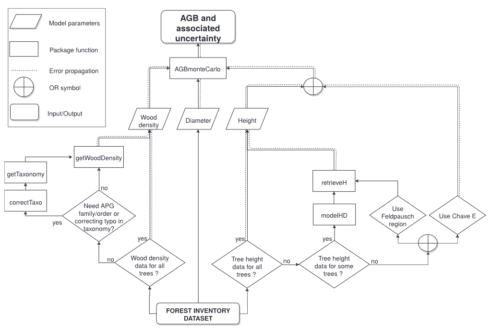
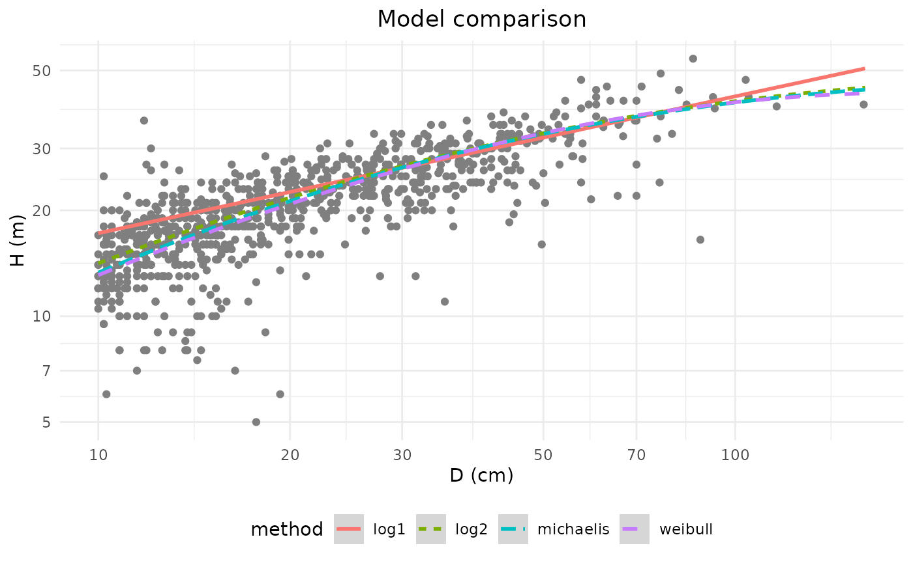
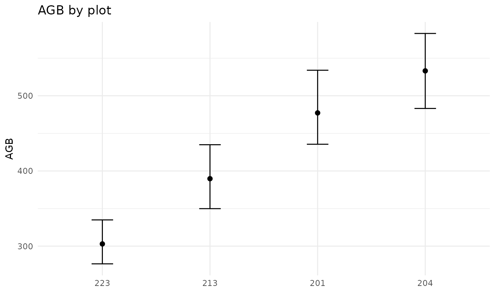
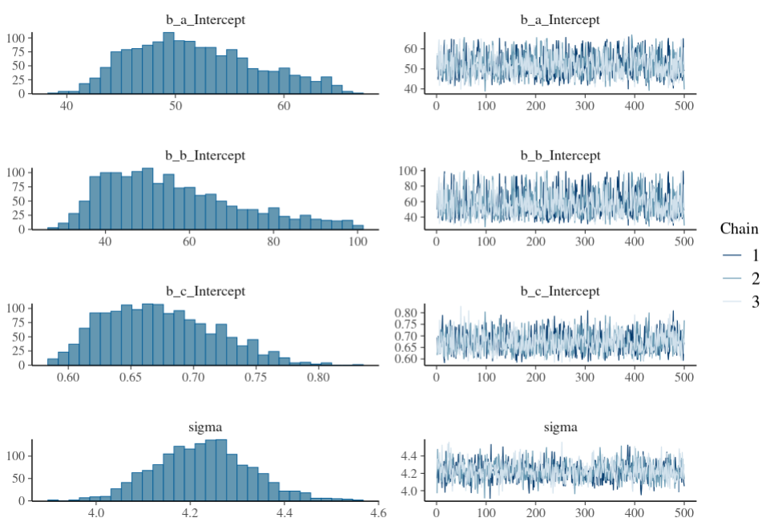

# Estimating stand biomass

## General workflow and required data

For the sake of clarity, and to be consistent with the BIOMASS paper
([Réjou-Méchain et
al. 2017](https://besjournals.onlinelibrary.wiley.com/doi/10.1111/2041-210X.12753)),
this vignette follows the same workflow as presented in the paper:



As can be seen, the **estimate of the above ground biomass** (AGB) of a
tree, and **its associated uncertainty**, is based on its **wood
density**, **diameter**, and **height**.

However, exhaustive values of **wood density** and **height** are rarely
available in forest inventory data. This is why the package proposes an
estimate of these two covariables, based on more usual data.

In this vignette, we will use some of the data obtained in 2012 from a
[forest
inventory](https://dataverse.cirad.fr/dataset.xhtml?persistentId=doi:10.18167/DVN1/TZ1RL9)
conducted in 2012 in the Nouragues forest (French Guiana). For
educational purpose, some virtual trees have been added to the data.

``` r
data("NouraguesTrees")
knitr::kable(head(NouraguesTrees))
```

|       | Site          | Plot | Xfield | Yfield | Family        | Genus               | Species     |    D |
|:------|:--------------|-----:|-------:|-------:|:--------------|:--------------------|:------------|-----:|
| 14    | Petit_Plateau |  201 |    0.0 |   31.5 | Burseraceae   | Protium             | surinamense | 11.0 |
| 44    | Petit_Plateau |  201 |    0.1 |   75.2 | Anacardiaceae | Tapirira            | guianensis  | 74.4 |
| 13    | Petit_Plateau |  201 |    0.2 |   27.6 | Lecythidaceae | Indet.Lecythidaceae | Indet.      | 25.4 |
| 2810  | Petit_Plateau |  201 |   -4.0 |   67.5 | Euphorbiaceae | Conceveiba          | guyanensis  | 10.0 |
| 24    | Petit_Plateau |  201 |    0.3 |   39.9 | Burseraceae   | Protium             | altissimum  | 18.9 |
| 12100 | Petit_Plateau |  201 |   -3.5 |   41.5 | Euphorbiaceae | Mabea               | speciosa    | 10.0 |

These data do not contain any information on wood density or height of
trees. Only diameter is known, as no estimate can be made without this
information.

## Wood density

**Wood density** is estimated **from tree taxonomy**, using the [Global
Wood Density Database v.2](https://zenodo.org/records/18262736) as a
reference. So the first step might be to correct tree taxonomy.

### Checking and retrieving tree taxonomy

This is done with the
[`correctTaxo()`](https://umr-amap.github.io/BIOMASS/reference/correctTaxo.md)
function, but before calling it, let’s speak about cache !

When the function is called for the first time with the argument
`useCache = TRUE`, a temporary file containing the request to
[WFO](https://www.worldfloraonline.org/) will be automatically created
in an existing folder. Once this has been done, during the current
session **the use of `useCache = TRUE` will access the saved temporary
file** in order to avoid time-consuming replication of server requests.
But **by quitting the current R session, this temporary file will be
removed**. So before calling
[`correctTaxo()`](https://umr-amap.github.io/BIOMASS/reference/correctTaxo.md),
we advise you to define a folder which will host the cache file
permanently, enabling to work offline.

``` r
# By default
createCache() 
# Or if you want to set your own cache folder
createCache("the_path_to_your_cache_folder") 
# Or 
options("BIOMASS.cache" = "the_path_to_your_cache_folder")
```

That said, let’s continue with the call to
[`correctTaxo()`](https://umr-amap.github.io/BIOMASS/reference/correctTaxo.md)
function:

``` r
Taxo <- correctTaxo(
  genus = NouraguesTrees$Genus, # genus also accepts the whole species name (genus + species) or (genus + species + author) 
  species = NouraguesTrees$Species, 
  useCache = TRUE, interactive = F, preferFuzzy = T)
saveRDS(Taxo, file = "saved_data/Taxo_vignette.rds")
```

The corrected genus and species of the trees can now be added to the
data:

``` r
NouraguesTrees$GenusCorrected <- Taxo$genusAccepted
NouraguesTrees$SpeciesCorrected <- Taxo$speciesAccepted
```

Here, as an example, the species name of the fourth tree has been
corrected from “guyanensis” to “guianensis” (the fourth row of
correctTaxo() output has a TRUE value for the column nameModified) :

``` r
NouraguesTrees$Species[4]
#> [1] "guyanensis"
Taxo[4,]
#>            nameOriginal         nameSubmitted           nameMatched
#> 4 Conceveiba guyanensis conceveiba guyanensis Conceveiba guianensis
#>            nameAccepted familyAccepted genusAccepted speciesAccepted
#> 4 Conceveiba guianensis  Euphorbiaceae    Conceveiba      guianensis
#>   nameModified
#> 4         TRUE
```

You can also retrieve APG III families from genus names, in the
familyAccepted column.

``` r
NouraguesTrees$family <- Taxo$familyAccepted
```

### Getting wood density

Wood densities are retrieved using
[`getWoodDensity()`](https://umr-amap.github.io/BIOMASS/reference/getWoodDensity.md)
function. By default, this function assigns to each taxon a species- or
genus-level average if at least one wood density value of the same
species or genus is available in the reference database. For
unidentified trees or if the genus is missing in the reference database,
the stand-level mean wood density is assigned to the tree.

``` r
wood_densities <- getWoodDensity(
  genus = NouraguesTrees$GenusCorrected,
  species = NouraguesTrees$SpeciesCorrected,
  stand = NouraguesTrees$Plot # for unidentified or non-documented trees in the reference database
)
#> Your taxonomic table contains 379 taxa
#> Warning in getWoodDensity(genus = NouraguesTrees$GenusCorrected, species =
#> NouraguesTrees$SpeciesCorrected, : 169 taxa don't match the Global Wood Density
#> Database V2. You may provide 'family' to match wood density estimates at family
#> level.

NouraguesTrees$WD <- wood_densities$meanWD
```

For information, here are the number of wood density values estimated at
the species, genus and plot level:

``` r
# At species level
sum(wood_densities$levelWD == "species")
#> [1] 1635
# At genus level
sum(wood_densities$levelWD == "genus")
#> [1] 246
# At plot level
sum(!wood_densities$levelWD %in% c("genus", "species"))
#> [1] 169
```

The `family` argument also assigns to the trees a family-level wood
density average, but bear in mind that the taxon-average approach gives
relatively poor estimates above the genus level (Flores & Coomes 2011).

**Additional wood density values (mean and error) can be added** using
the `addWoodDensityData` argument (here invented for the example):

``` r
LocalWoodDensity <- data.frame(
  genus = c("Paloue", "Handroanthus"),
  species = c("princeps", "serratifolius"),
  meanWD = c(0.65, 0.72),
  sdWD = c(0.061, 0.042))

add_wood_densities <- getWoodDensity(
  genus = NouraguesTrees$GenusCorrected,
  species = NouraguesTrees$SpeciesCorrected,
  family = NouraguesTrees$family,
  stand = NouraguesTrees$Plot,
  addWoodDensityData = LocalWoodDensity
)
```

## Height

As tree height measurements are rare, or rarely exhaustive, BIOMASS
proposes three methods to estimate tree height:

If a subset of well-measured trees is available in the studied region:

- Construct a local Height–Diameter (H-D) allometry

If not:

- Use the continent- or region-specific H–D models proposed by
  [Feldpausch et
  al. (2012)](https://bg.copernicus.org/articles/9/3381/2012/)
- Use a generic H–D model based on a single bioclimatic predictor E (eqn
  6a in [Chave et
  al. 2014](https://onlinelibrary.wiley.com/doi/abs/10.1111/gcb.12629))

### Building a local H-D model

As no height measurements is available in the `NouraguesTrees` dataset,
we will use the `NouraguesHD` dataset which contains the height and
diameter measurements of two 1-ha plots from the Nouragues forest.

``` r
data("NouraguesHD")
```

The
[`modelHD()`](https://umr-amap.github.io/BIOMASS/reference/modelHD.md)
function is used to either **compare four implemented models to fit H–D
relationships** in the tropics, or to **compute the desired H-D model**.

Here we first compare the four H-D models using linear regression (for
log^1 and log^2 models) or nonlinear least squares estimates (for
Michaelis-Menten and Weibull models) :

``` r
HD_res <- modelHD(
  D = NouraguesHD$D, H = NouraguesHD$H,
  useWeight = TRUE, drawGraph = T)
```



    #> To build a HD model you must use the parameter 'method' in this function

    kable(HD_res)

| method    |      RSE |    RSElog | Average_bias |
|:----------|---------:|----------:|-------------:|
| log1      | 4.700088 | 0.2472750 |    0.0724598 |
| log2      | 4.329727 | 0.2240379 |    0.0182504 |
| weibull   | 4.307951 |        NA |   -0.0186951 |
| michaelis | 4.294488 |        NA |   -0.0064068 |

As the log2 model has the lowest RSE, we will build this model using the
`method` argument and add its predictions to the dataset with the
[`retrieveH()`](https://umr-amap.github.io/BIOMASS/reference/retrieveH.md)
function:

``` r
HDmodel <- modelHD(
  D = NouraguesHD$D, H = NouraguesHD$H,
  method = "log2", useWeight = TRUE, 
  bayesian = FALSE)

H_model <- retrieveH(
  D = NouraguesTrees$D,
  model = HDmodel)

NouraguesTrees$H_model <-  H_model$H
```

By default, `bayesian = TRUE` in
[`modelHD()`](https://umr-amap.github.io/BIOMASS/reference/modelHD.md)
arguments. In this case, a Bayesian model will be fitted using the brms
package (see section [Building bayesian Height-Diameter
models](#bayesian-models)), ensuring proper propagation of parameter
uncertainties. As this method is more time-consuming, for educational
purposes, we will set bayesian = FALSE.

Note that if some of the trees’ heights had been measured in the
`NouraguesTrees` dataset, we could have provided these heights to
[`modelHD()`](https://umr-amap.github.io/BIOMASS/reference/modelHD.md).
In this case, we could also have created a model for each
stand/sub-region present in `NouraguesTrees` using the `plot` argument.
But keep in mind that even for well-measured trees,
[`retrieveH()`](https://umr-amap.github.io/BIOMASS/reference/retrieveH.md)
gives you the predicted height (see [this
section](#mixing-measured_estimated)).

### Using the continent- or region-specific H–D model (Feldpausch)

No need to compute any model here, as the predictions of the model
proposed by Feldspausch et al. are directly retrieved by the
[`retrieveH()`](https://umr-amap.github.io/BIOMASS/reference/retrieveH.md)
function. Simply indicate the region concerned:

``` r
H_feldspausch <- retrieveH(
  D = NouraguesTrees$D,
  region = "GuianaShield")

NouraguesTrees$H_feldspausch <- H_feldspausch$H
```

Available regions are listed in the documentation of the function.

### Using the generic H–D model based on a bioclimatic predictor (Chave)

In the same way as for the previous model, the predictions of the model
proposed by Chave et al. are directly retrieved by the
[`retrieveH()`](https://umr-amap.github.io/BIOMASS/reference/retrieveH.md)
function. Coordinates of the plot (or trees) in a longitude/latitude
format must be provided.

``` r
data("NouraguesCoords") #contains corner coordinates
coords <- apply(NouraguesCoords[c("Long","Lat")] , 2, mean) # compute the mean of the corner coordinates

H_chave  <- retrieveH(
  D = NouraguesTrees$D,
  coord = coords)

NouraguesTrees$H_chave <- H_chave$H
```

## Estimate AGB

Once tree diameter, wood density and height have been retrieved, the
generalised allometric model (eqn 4 of [Chave et
al. (2014)](https://onlinelibrary.wiley.com/doi/abs/10.1111/gcb.12629))
can be used with the
[`computeAGB()`](https://umr-amap.github.io/BIOMASS/reference/computeAGB.md)
function, where AGB values are reported in Mg instead of in kg:

``` r
NouraguesTrees$AGB <- computeAGB(
  D = NouraguesTrees$D,
  WD = NouraguesTrees$WD,
  H = NouraguesTrees$H_model #here with the local H-D predictions
  )
```

For AGB estimates using tree heights obtained by the “Chave method”
(H_chave), it is more accurate to provide the area coordinates directly
instead of the tree height estimates:

``` r
NouraguesTrees$AGB_Chave <- computeAGB(
    D = NouraguesTrees$D,
    WD = NouraguesTrees$WD,
    coord = coords)
```

## Propagate AGB errors

The
[`AGBmonteCarlo()`](https://umr-amap.github.io/BIOMASS/reference/AGBmonteCarlo.md)
function allows the user to propagate different sources of error up to
the final AGB estimate.

The error propagation due to the **uncertainty of the model parameters**
of the AGB allometric equation (Chave et al. 2014) **is automatically
performed** by the function. However, the propagation of the error due
to the **uncertainty of the model variables** (D, WD and H) can be
**parameterized by the user**.

### Diameter measurement error

Using the `Dpropag` argument of the
[`AGBmonteCarlo()`](https://umr-amap.github.io/BIOMASS/reference/AGBmonteCarlo.md)
function, the user can set diameter measurement errors by:

- providing a standard deviation value corresponding to the measurement
  uncertainty (e.g `Dpropag = 1`)
- providing a vector of standard deviation values associated with each
  tree measurement uncertainty
- using the implemented example of Chave et al. 2004 with
  `Dpropag = "chave2004"`, where small errors are applied on 95% of the
  trees and large errors to the remaining 5%

``` r
D_error_prop <- AGBmonteCarlo(
  D = NouraguesTrees$D, WD = NouraguesTrees$WD, H = NouraguesTrees$H_model,
  Dpropag = "chave2004",
  errWD = rep(0,nrow(NouraguesTrees)), errH = 0 # no error propagation on WD and H here
)
```

### Wood density error

The
[`getWoodDensity()`](https://umr-amap.github.io/BIOMASS/reference/getWoodDensity.md)
function returns prior standard deviation values associated with each
tree wood density using the mean standard deviation of the [global wood
density database](https://datadryad.org/dataset/doi:10.5061/dryad.234)
at the species, genus and family levels.

This output can be provided through the `errWD` argument:

``` r
WD_error_prop <- AGBmonteCarlo(
  D = NouraguesTrees$D, WD = NouraguesTrees$WD, H = NouraguesTrees$H_model,
  errWD = wood_densities$sdWD,
  Dpropag = 0 , errH = 0 # no error propagation on D and H here
)
```

### Height error

The user can provide either a SD value or a vector of SD values
associated with tree height measurement errors, using the `errH`
argument.

- **If tree heights have been estimated via a local HD-model**, instead
  of the providing `errH` and `H` arguments, the user has to provide the
  output of the
  [`modelHD()`](https://umr-amap.github.io/BIOMASS/reference/modelHD.md)
  function using the `modelHD` argument:

``` r
H_model_error_prop <- AGBmonteCarlo(
  D = NouraguesTrees$D, WD = NouraguesTrees$WD, # we do not provide H
  HDmodel = HDmodel, # but we provide HDmodel
  Dpropag = 0 , errWD = rep(0,nrow(NouraguesTrees)) # no error propagation on D and WD here
)
```

Note that when HDmodel is not a bayesian model, uncertainties of the
parameters are not propagated during the error propagation of the
AGBmonteCarlo() function.

- **If tree heights have been estimated via the “Feldspausch” method**,
  the user has to provide the output of the
  [`retrieveH()`](https://umr-amap.github.io/BIOMASS/reference/retrieveH.md)
  function for the `errH` argument:

``` r
H_feld_error_prop <- AGBmonteCarlo(
  D = NouraguesTrees$D, WD = NouraguesTrees$WD,
  H = NouraguesTrees$H_feldspausch, errH = H_feldspausch$RSE, # we provide H and errH
  Dpropag = 0 , errWD = rep(0,nrow(NouraguesTrees)) # no error propagation on D and WD here
)
```

- **If tree heights have been estimated via the “Chave” method**, the
  user has to provide the coordinates of the area (or of the trees)
  using the `coord` argument:

``` r
H_chave_error_prop <- AGBmonteCarlo(
  D = NouraguesTrees$D, WD = NouraguesTrees$WD, # we do not provide H
  coord = coords, # but we provide the vector of median coordinates of the plots
  Dpropag = 0 , errWD = rep(0,nrow(NouraguesTrees)) # no error propagation on D and WD here
)
```

### All together and AGB visualisation of plots

Let’s propagate all sources of errors using the HD-model:

``` r
error_prop <- AGBmonteCarlo(
  D = NouraguesTrees$D, WD = NouraguesTrees$WD, # we do not provide H
  HDmodel = HDmodel, # but we provide HDmodel
  Dpropag = "chave2004",
  errWD = wood_densities$sdWD)

error_prop[(1:4)]
#> $meanAGB
#> [1] 1671.145
#> 
#> $medAGB
#> [1] 1670.682
#> 
#> $sdAGB
#> [1] 46.33488
#> 
#> $credibilityAGB
#>     2.5%    97.5% 
#> 1582.272 1764.058
```

The first four elements of the output contain the mean, median, standard
deviation and credibility intervals of the total AGB of the dataset but
nothing about the AGB at the plot level. To do this, you can use the
[`summaryByPlot()`](https://umr-amap.github.io/BIOMASS/reference/summaryByPlot.md)
function:

``` r
AGB_by_plot <- summaryByPlot(AGB_val = error_prop$AGB_simu, plot = NouraguesTrees$Plot, drawPlot = TRUE)
```



Finally, the last element (`$AGB_simu`) of the
[`AGBmonteCarlo()`](https://umr-amap.github.io/BIOMASS/reference/AGBmonteCarlo.md)
output is a matrix containing the simulated tree AGB values (in rows)
for each iteration of the Monte Carlo procedure (in columns).

## Some tricks

### Mixing measured and estimated height values

If you want to use a mix of directly-measured height and of estimated
ones, you can proceed as follows:

1.  Build a vector of H and RSE where we assume an error of 0.5 m on
    directly measured trees

``` r
# NouraguesHD contains 163 trees that were not measured
NouraguesHD$Hmix <- NouraguesHD$H
NouraguesHD$RSEmix <- 0.5
filt <- is.na(NouraguesHD$Hmix)
NouraguesHD$Hmix[filt] <- retrieveH(NouraguesHD$D, model = HDmodel)$H[filt]
NouraguesHD$RSEmix[filt] <- HDmodel$RSE
```

2.  Apply the AGBmonteCarlo by setting the height values and their
    errors (which depend on whether the trees were directly measured or
    estimated)

``` r
wd <- getWoodDensity(NouraguesHD$genus, NouraguesHD$species)
resultMC <- AGBmonteCarlo(
  D = NouraguesHD$D, WD = wd$meanWD, errWD = wd$sdWD,
  H = NouraguesHD$Hmix, errH = NouraguesHD$RSEmix,
  Dpropag = "chave2004"
)
summaryByPlot(AGB_val = resultMC$AGB_simu, plot = NouraguesHD$plotId, drawPlot = TRUE)
```

### Building bayesian Height-Diameter models

Since version 2.2.6, BIOMASS enables to build bayesian H-D models using
the [brms package](https://paulbuerkner.com/brms/).

As compiling the Stan programme may take some time the first time
around, we recommend setting the ‘useCache’ argument to TRUE in the
[`modelHD()`](https://umr-amap.github.io/BIOMASS/reference/modelHD.md)
function. This will save the model as a .rds file in the defined cache
path, meaning that next time, the model will simply be loaded and
updated, bypassing the compilation stage.

``` r
# First, define the user cache path
createCache("the_path_to_your_cache_folder") 
# Or 
options("BIOMASS.cache" = "the_path_to_your_cache_folder")

brm_model <- modelHD(
  D = NouraguesHD$D, H = NouraguesHD$H,
  method = "log2",
  bayesian = TRUE, useCache = TRUE)

H_brm_model <- retrieveH(
  D = NouraguesTrees$D,
  model = brm_model)
NouraguesTrees$H_model <-  H_brm_model$H
```

If the **Michaelis-Menten or Weibull methods are used**, you must pay
close attention to the returned models as the algorithm is likely to
identify numerous **local minima for the estimated parameters**. Here is
an example of the Weibull method being used with the default arguments:

``` r
brm_model <- modelHD(
  D = NouraguesHD$D, H = NouraguesHD$H,
  method = "weibull",
  bayesian = TRUE, useCache = TRUE)

plot(brm_model$model)
```


As one can see, the two first parameters a and b (resp. called
`b_a_Intercept` and `b_b_Intercept`) of the Weibull equation:
$$H = a \cdot \left( 1 - exp\left( - (D/b)^{c} \right) \right)$$ are
strongly correlated. Therefore, it is strongly recommended to define
priors that do not allow for unrealistic values. To do this, we need to
examine the meanings of the Weibull parameters:

- `a` can be considered as the hypothetical maximum height, so defining
  a uniform prior between 0 and 80m seems realistic.
- `b` is the scaling parameter, so defining a uniform prior between 0
  and a high value of D (e.g. the 90th percentile) makes sense.
- `c` is the shape parameter which must be between 0 and 1

Besides, since model parameters and chain iterations are strongly
correlated, an increase of `thin`, `iter` and `warmup` is required (see
the help of brms::brm() and [this
page](https://mc-stan.org/learn-stan/diagnostics-warnings.html) for more
details).

The arguments of
[`brms::brm()`](https://paulbuerkner.com/brms/reference/brm.html) (cited
above) can be provided to
[`modelHD()`](https://umr-amap.github.io/BIOMASS/reference/modelHD.md):

``` r
weibull_priors <- c(
  set_prior(prior = "uniform(0,80)", lb = 0, ub = 80, class = "b",nlpar = "a"),
  set_prior(prior = "uniform(0,100)", lb = 0, ub = 100, class = "b",nlpar = "b"),
  set_prior(prior = "uniform(0.01,0.99)", lb = 0.01, ub = 0.99, class = "b",nlpar = "c")
)

brm_model <- modelHD(D = NouraguesHD$D, H = NouraguesHD$H,
                     method = "weibull", bayesian = TRUE, useCache = TRUE,
                     prior = weibull_priors,
                     thin = 10, iter = 6000, warmup = 1000,
                     cores = 3 # number of cores = 3 since 3 chains are running 
)

plot(brm_model$model)
```



Posterior distributions look better but the right-skewed distributions
are not yet satisfactory. So **we recommend using the log2 method when
the RSE given by lm and nls models (when bayesian = FALSE) are close**.

### Add your tricks

If you would like to share a code that might be useful to users (code
authorship will be respected), you can create a new issue on the
[BIOMASS github page](https://github.com/umr-amap/BIOMASS/issues), or
contact Dominique (<dominique.lamonica@ird.fr>).
