# Predict maps of AGBD based on inventory and LiDAR data

## Overview

BIOMASS enables users to predict AGBD maps at the landscape level, with
uncertainties per pixel. For that, both inventory and LiDAR data are
required.

To predict AGBD maps, we are going to calibrate a model describing the
relationship between AGBD estimated at plot level, and the corresponding
value of one LiDAR metric (a Canopy Height Model - CHM, for example).
Once this model has been calibrated using AGBD and CHM values of each
plot, AGBD is computed for each pixel of the landscape based on the
LiDAR metric value at the pixel, according to the model.

In order to easily propagate AGBD uncertainties that have been
propagated through the previous steps in BIOMASS model calibration and
prediction is done within Bayesian framework using brms
[package](https://paulbuerkner.com/brms/index.html). Since prediction
can be quite time consuming, depending on landscape size and chosen
resolution, it is possible to run parallel using doFuture
[package](https://future.futureverse.org/index.html), see below “Run
prediction in parallel” section.

### Mathematical modelling

The model we chose to describe the relationship between plot-level AGBD
and LiDAR metrics is a log-log regression, with a Gaussian error model.
To capture the spatial structure that may exists in the data, we use a
Spatially Varying Coefficient (SVC) regression with Gaussian random
fields [Hunka et al., 2025](https://doi.org/10.1016/j.rse.2024.114557).

The general equation can be written as follow, for a subplot $s_{i}$:

\$\$ Y_i \sim \mathrm{N}(\mu_i, \sigma) \\ \mu_i = (\beta_1 + \eta_i)
\times X_i \\ \eta_i \sim \mathrm{MVNormal}(0, \Sigma) \\ \$\$ $\Sigma$,
the covariance matrix, is defined by the $\frac{3}{2}$ M'{a}tern kernel
between two locations $s_{i}$ and $s_{j}$:

$$k\left( \mathbf{s}_{i},\mathbf{s}_{j} \right) = \psi^{2}\left( 1 + \frac{\sqrt{3}d_{i,j}}{l} \right)\exp\left( - \frac{\sqrt{3}d_{i,j}}{l} \right)$$$d_{i,j}$
is the distance between locations $s_{i}$ and $s_{j}$, parameter $\psi$
controls the magnitude and parameter $l$ the range of the kernel.

In our case $X$ stands for the logarithm of plot-level AGBD, while $Y$
is the logarithm of a LiDAR metric measurement for the corresponding
plot, for instance the mean of the Canopy Height Model on the plot
surface.

### Warning on vignette example

In order to keep this vignette light and usable, the procedure is
displayed and illustrated using a very small dataset. The dataset
comprises 4 one hectare plots, the plots being very close together in
space, and the CHM raster of the rectangular extent around the plots, at
1m resolution, as LiDAR data. Obviously, predicting biomass map on such
a small landscape does not make sense. However, predicting a sensibly
larger map based on the same plot data would not be better since it is
definitely not enough, both in terms of data quantity and spatial
arrangement quality, to obtain robust and reliable final predictions! So
keep in mind that this data case scenario is only here to illustrate the
functions.

You may run some quick quality checks to assess if a dataset is
appropriate for such a regression, *e.g.* looking at CHM distribution
against tree height distribution, checking LiDAR metric range in your
calibration dataset vs. in the entire landscape, looking at the plots
spatial arrangement in the landscape, checking that pairwise distances
between inventory plots are more or less regularly distributed along the
range.

## Previous steps

Those steps of the procedure are detailed in the two other vignettes.

### Load inventory, plot coordinates and LiDAR data

``` r
data("NouraguesTrees")
data("NouraguesCoords")
nouraguesRaster <- terra::rast(system.file("extdata", "NouraguesRaster.tif",package = "BIOMASS", mustWork = TRUE))
```

### Compute AGBD

``` r
# Height
data("NouraguesHD")
brm_model <- modelHD(
  D = NouraguesHD$D, H = NouraguesHD$H,
  method = "log2",
  bayesian = TRUE, useCache = TRUE)

# Wood density
Taxo <- readRDS(file = "saved_data/Taxo_vignette.rds")
NouraguesTrees$GenusCorrected <- Taxo$genusAccepted
NouraguesTrees$SpeciesCorrected <- Taxo$speciesAccepted
NouraguesTrees$family <- Taxo$familyAccepted
wood_densities <- getWoodDensity(
  genus = NouraguesTrees$GenusCorrected,
  species = NouraguesTrees$SpeciesCorrected,
  family = NouraguesTrees$family,
  stand = NouraguesTrees$Plot
)
NouraguesTrees$WD <- wood_densities$meanWD

error_prop_4plots <- AGBmonteCarlo(
  D = NouraguesTrees$D, WD = NouraguesTrees$WD,
  HDmodel = brm_model,
  Dpropag = "chave2004",
  errWD = wood_densities$sdWD)
# keep only 50 iterations per tree for vignette example
error_prop_4plots$AGB_simu <- error_prop_4plots$AGB_simu[,1:50]
```

### Spatialize AGBD

``` r
# divide plots into subplots
multiple_subplots <- divide_plot(
  grid_size = 50, 
  corner_data = NouraguesCoords,
  rel_coord = c("Xfield","Yfield"), proj_coord = c("Xutm","Yutm"), corner_plot_ID = "Plot",
  tree_data = NouraguesTrees, tree_coords = c("Xfield","Yfield"), tree_plot_ID = "Plot"
)
#> Warning in divide_plot(grid_size = 50, corner_data = NouraguesCoords, rel_coord
#> = c("Xfield", : One or more trees could not be assigned to a subplot (not in a
#> subplot area)

# check with raster, optional
multiple_checks <- check_plot_coord(
  corner_data = NouraguesCoords, # NouraguesCoords contains 4 plots
  proj_coord = c("Xutm", "Yutm"), rel_coord = c("Xfield", "Yfield"),
  trust_GPS_corners = TRUE,
  plot_ID = "Plot",
  tree_data = NouraguesTrees, tree_coords = c("Xfield","Yfield"),
  prop_tree = "D", tree_plot_ID = "Plot",
  ref_raster = nouraguesRaster)
#> In plot 201 : Be careful, one or more trees are not inside the plot defined by rel_coord (see is_in_plot column of tree_data output)
#> In plot 213 : Be careful, one or more trees are not inside the plot defined by rel_coord (see is_in_plot column of tree_data output)
#> In plot 223 : Be careful, one or more trees are not inside the plot defined by rel_coord (see is_in_plot column of tree_data output)
```

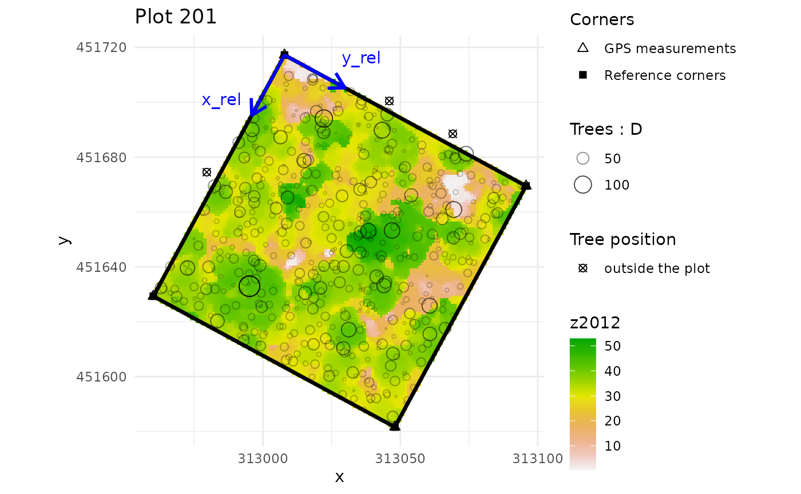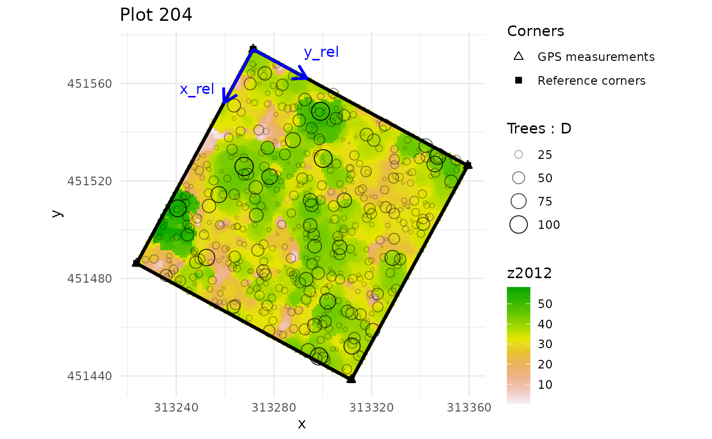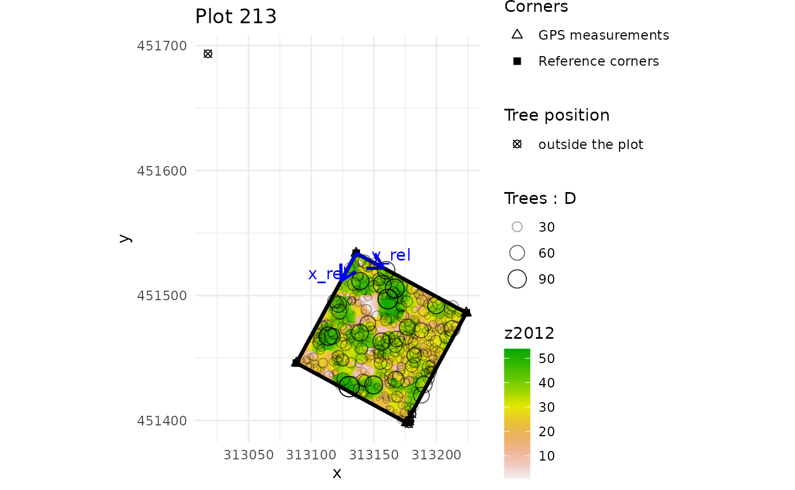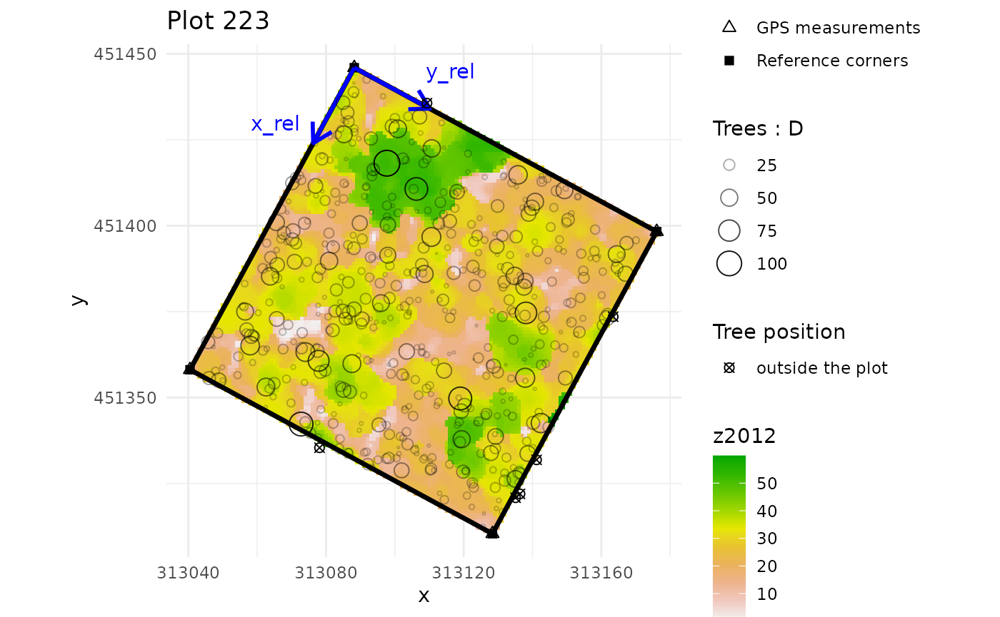

``` r

# compute AGBD estimates and their uncertainty per subplot
subplot_AGBD <- subplot_summary(
  subplots = multiple_subplots,
  AGB_simu = error_prop_4plots$AGB_simu, draw = F
)
#> AGB uncertainties will be propagated without propagation of corner GPS measurement uncertainties.
```

### Spatialize LiDAR metric

``` r
# quick plot to visualise plot corners in the landscape
terra::plot(nouraguesRaster)
points(NouraguesCoords$Xutm, NouraguesCoords$Yutm, col ="red", pch = 20)
```

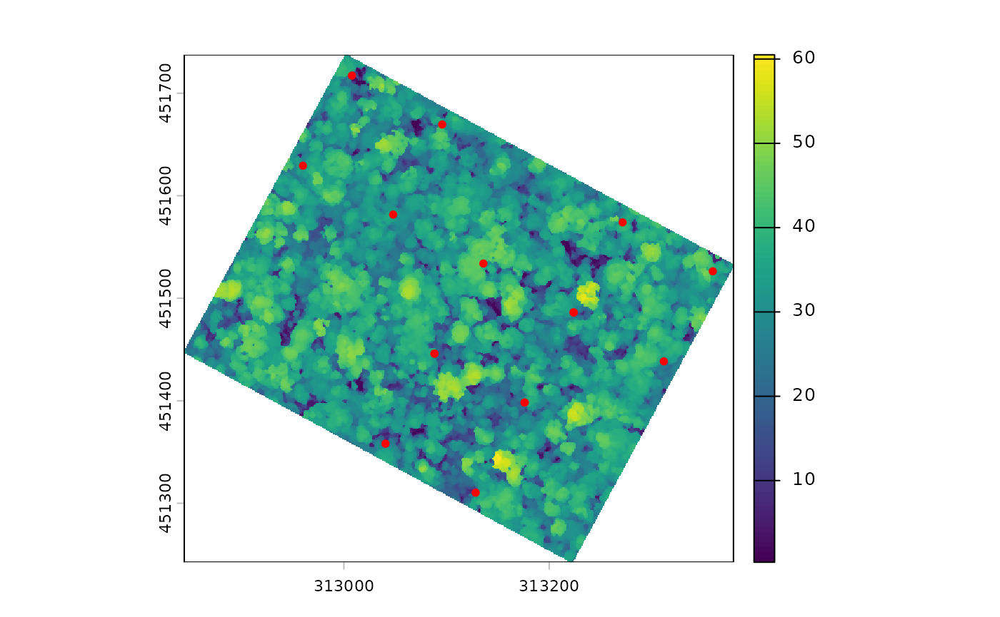

``` r

# get CHM median values for each suplot
raster_summary <- subplot_summary(
  subplots = multiple_subplots,
  ref_raster = nouraguesRaster, raster_fun = median, na.rm = T)
#> Extracting raster metric...Extracting raster metric done.
#> [[1]]
```

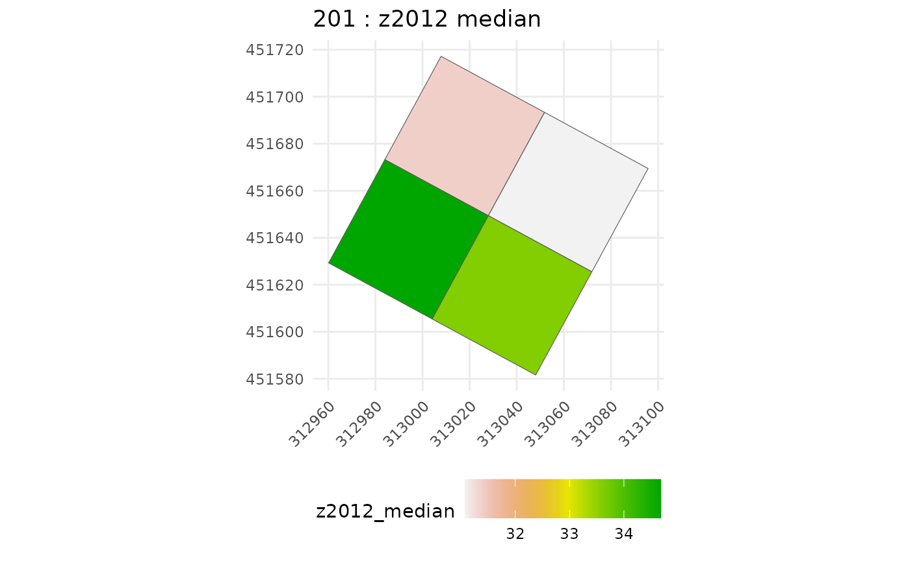

    #> 
    #> [[1]]

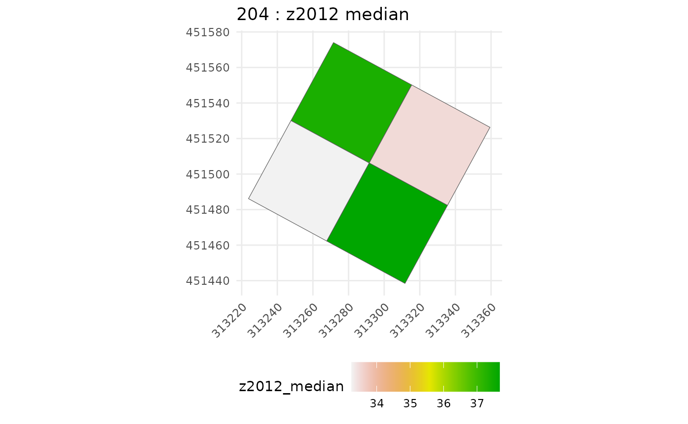

    #> 
    #> [[1]]

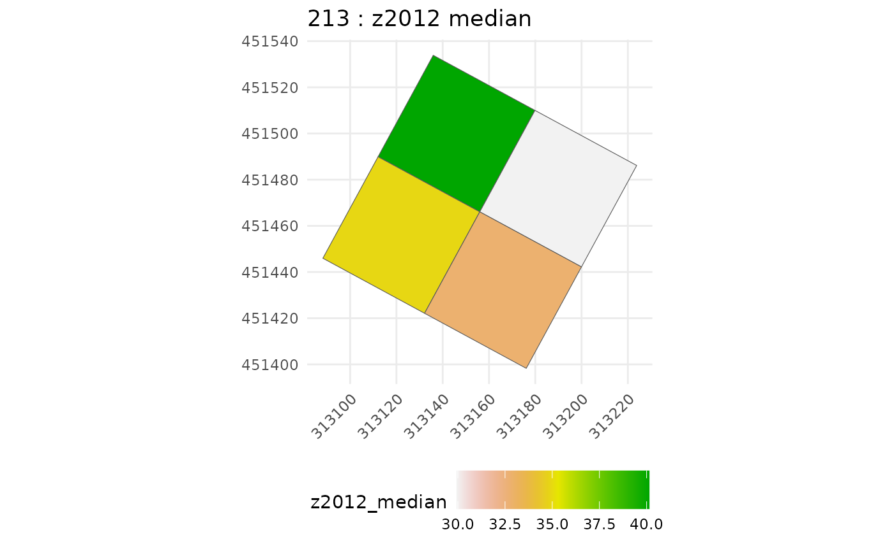

    #> 
    #> [[1]]

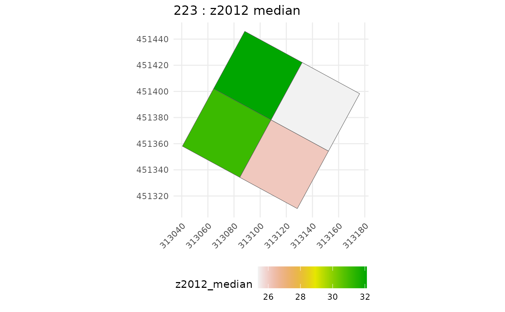

``` r
chm_subplot <- raster_summary$tree_summary |>
  rename(raster_metric = z2012_median)
```

## Calibrate model

Gather data for agbd-chm model inference (*i.e.* join
predictor-predicted):

``` r
agbd_subplot <- subplot_AGBD$long_AGB_simu
dt_inf <- agbd_subplot %>%
  left_join(chm_subplot, by = "subplot_ID") %>%
  arrange(subplot_ID)
```

then run calibration function, here parallelized on four CPUs:

``` r
model_cal <- calibrate_model(long_AGB_simu = dt_inf, nb_rep = 50, useCache = T,
                            plot_model = FALSE, chains = 4, thin = 20, iter = 4000,
                            warmup = 1000, cores = 4)
```

Let’s check inference results:

``` r
summary(model_cal)
#>  Family: gaussian 
#>   Links: mu = identity 
#> Formula: log_AGBD ~ 0 + betatilde * log_CHM 
#>          betatilde ~ 1 + gp(x, y, gr = T, scale = T, cov = "matern32")
#>    Data: dt_inf (Number of observations: 800) 
#>   Draws: 4 chains, each with iter = 4000; warmup = 1000; thin = 20;
#>          total post-warmup draws = 600
#> 
#> Gaussian Process Hyperparameters:
#>                        Estimate Est.Error l-95% CI u-95% CI Rhat Bulk_ESS
#> sdgp(betatilde_gpxy)       0.06      0.02     0.03     0.11 1.00      521
#> lscale(betatilde_gpxy)     0.22      0.08     0.10     0.42 1.00      743
#>                        Tail_ESS
#> sdgp(betatilde_gpxy)        568
#> lscale(betatilde_gpxy)      639
#> 
#> Regression Coefficients:
#>                     Estimate Est.Error l-95% CI u-95% CI Rhat Bulk_ESS Tail_ESS
#> betatilde_Intercept     1.72      0.03     1.66     1.79 1.01      555      588
#> 
#> Further Distributional Parameters:
#>       Estimate Est.Error l-95% CI u-95% CI Rhat Bulk_ESS Tail_ESS
#> sigma     0.10      0.00     0.09     0.10 1.00      637      486
#> 
#> Draws were sampled using sampling(NUTS). For each parameter, Bulk_ESS
#> and Tail_ESS are effective sample size measures, and Rhat is the potential
#> scale reduction factor on split chains (at convergence, Rhat = 1).
```

The parameters to be read in the summary are the following:

- sdgp(betatilde_gpxy) is $\psi$ the magnitude of the covariance kernel,
- lscale(betatilde_gpxy) is $l$ the range of the covariance kernel (in
  the distance unit you have chosen),
- betatilde_Intercept is $\beta_{1}$ the fixed part of the regression
  coefficient,
- sigma is $\sigma$ the Gaussian residual standard deviation of the
  predicted variable (do not forget it is log scaled).

To properly use inference results, it is necessary to make sure that (i)
convergence between chains is met, and (ii) parameters samples are big
enough and not autocorrelated. For that the indicators you need to look
at are (i) Rhat, which should be below 1.05, and more generally the
closest to 1.00, and (ii) Bulk and Tail ESS, which should be the closest
possible to “total post-warmup draws”. To check for within-chain
autocorrelation, you can also use the `acf` function from `tseries`
package, such as:

``` r
require(tseries)
#> Loading required package: tseries
#> Warning in library(package, lib.loc = lib.loc, character.only = TRUE,
#> logical.return = TRUE, : there is no package called 'tseries'
lapply(model_cal$fit@sim$samples[[1]][1:4], acf, plot = F) # check the first chain
#> $b_betatilde_Intercept
#> 
#> Autocorrelations of series 'X[[i]]', by lag
#> 
#>      0      1      2      3      4      5      6      7      8      9     10 
#>  1.000  0.486  0.011  0.003  0.006  0.007 -0.004 -0.004 -0.007 -0.011 -0.019 
#>     11     12     13     14     15     16     17     18     19     20     21 
#> -0.028 -0.011 -0.012 -0.007 -0.001 -0.003  0.007  0.003 -0.002  0.003  0.020 
#>     22     23 
#>  0.022 -0.007 
#> 
#> $sdgp_betatilde_gpxy
#> 
#> Autocorrelations of series 'X[[i]]', by lag
#> 
#>      0      1      2      3      4      5      6      7      8      9     10 
#>  1.000  0.420 -0.003 -0.008 -0.004 -0.005 -0.006  0.002 -0.005  0.001  0.004 
#>     11     12     13     14     15     16     17     18     19     20     21 
#> -0.004 -0.002 -0.004 -0.003 -0.004 -0.005 -0.004  0.003  0.003 -0.003 -0.001 
#>     22     23 
#>  0.011 -0.001 
#> 
#> $lscale_betatilde_gpxy
#> 
#> Autocorrelations of series 'X[[i]]', by lag
#> 
#>      0      1      2      3      4      5      6      7      8      9     10 
#>  1.000  0.192 -0.001 -0.006 -0.001 -0.008  0.005 -0.004 -0.001 -0.012 -0.005 
#>     11     12     13     14     15     16     17     18     19     20     21 
#>  0.008  0.005  0.006 -0.004  0.000  0.003 -0.001  0.000  0.010 -0.010  0.013 
#>     22     23 
#> -0.002  0.007 
#> 
#> $sigma
#> 
#> Autocorrelations of series 'X[[i]]', by lag
#> 
#>      0      1      2      3      4      5      6      7      8      9     10 
#>  1.000  0.018  0.000  0.000  0.001  0.000  0.000  0.000  0.000 -0.001  0.000 
#>     11     12     13     14     15     16     17     18     19     20     21 
#> -0.001 -0.001 -0.001  0.001  0.000  0.000  0.000  0.000  0.001 -0.001 -0.001 
#>     22     23 
#> -0.001 -0.001
```

Here we can see that at the first lag we still have high within-chain
autocorrelation (\> 0.2) for some parameters, indicating that
re-inferring the model with the `thin` argument set to a higher value,
*e.g.* 30, will be beneficial.

You may also want to check correlations between estimated parameters.
They are not “bad” *per se*, since the information is comprised in the
inference output, and taken into account when predicting maps. But they
may interfere with the inference march and make it difficult to
converge.

``` r
require(GGally)
#> Loading required package: GGally
#> 
#> Attaching package: 'GGally'
#> The following object is masked from 'package:terra':
#> 
#>     wrap
ggpairs(as.data.frame(model_cal$fit@sim$samples[[1]][1:4]))
```

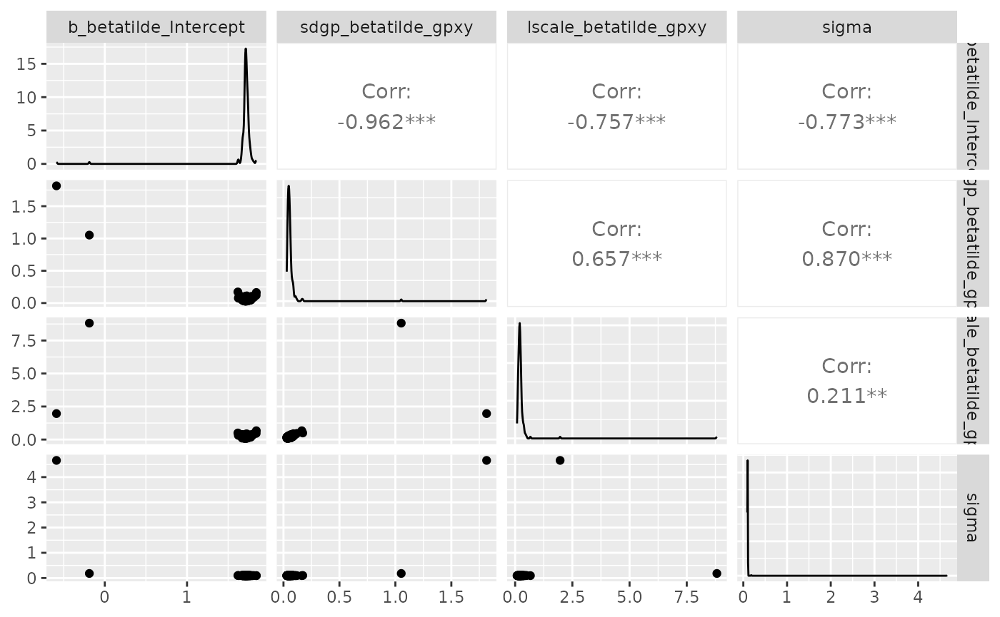

Now, let’s have a look at the posterior predictive check:

``` r
pp_check(model_cal, ndraws = 100)
```

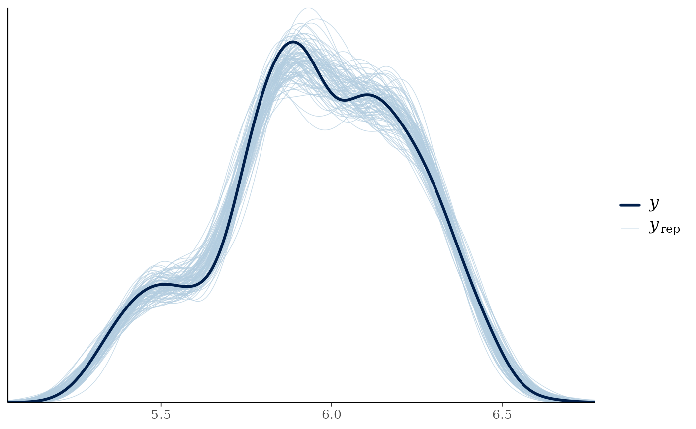

This posterior predictive check enables to quickly visualise if the
distribution of observed data `y`, blue bold line, matches the
distributions of data predicted by the calibrated model `y_rep`, light
blue lines - one per parameter draw or combination. Hence, it is an
indicator of the goodness of fit of the model to the data.

## Predict AGBD map on the LiDAR footprint

``` r
map_agbd <- predict_map(fit_brms = model_cal,
                         pred_raster = nouraguesRaster,
                         grid_size = 50,
                         raster_fun = median,
                         n_post_draws = 100,
                         alignment_raster = NULL,
                         plot_maps = F)
```

``` r
terra::plot(map_agbd$post_median_AGBD, main = "Median of posterior AGBD distributions")
```

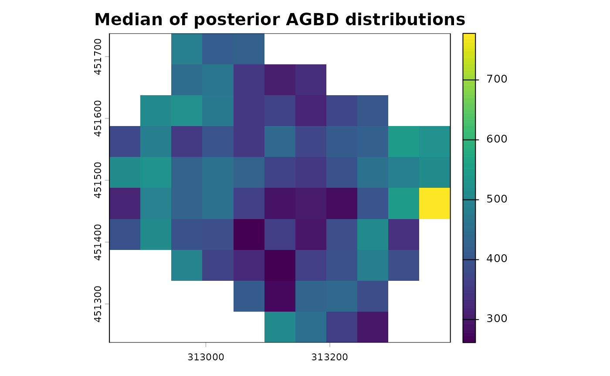

``` r
terra::plot(map_agbd$post_sd_AGBD, main = "Sd of posterior AGBD distributions")
```

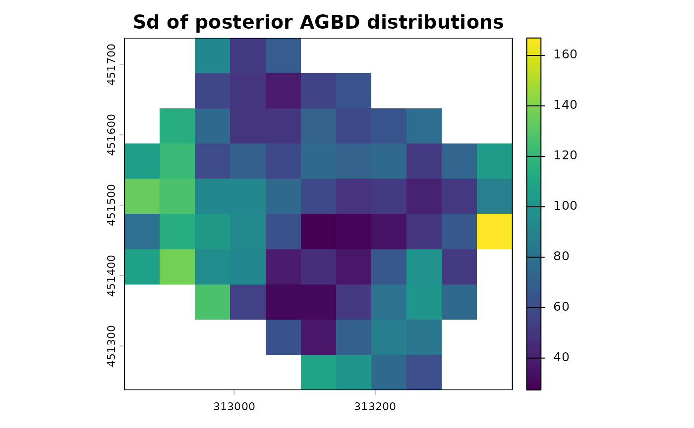

``` r
terra::plot(map_agbd$post_sd_AGBD/map_agbd$post_median_AGBD, main = "CV of posterior AGBD distributions")
```

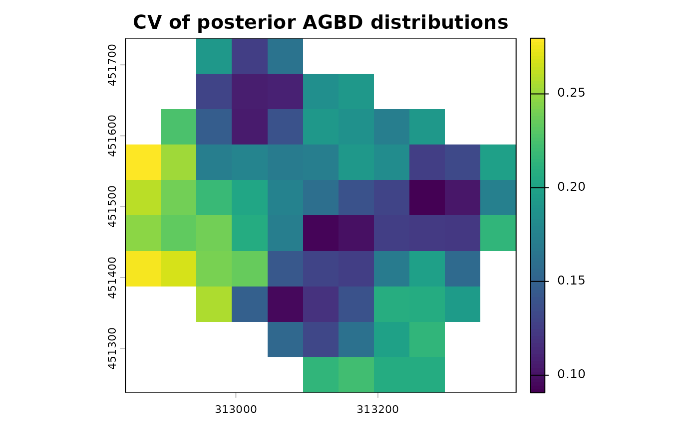

If you want to predict on another footprint, you can supply the raster
footprint with `alignment_raster` argument.

### Run prediction in parallel

Parallelisation of `predict_map` function is handled by the `future`
framework. So to compute the map predictions in parallel you only need
to set the `plan` to `multisession` with the numbers of workers, *i.e.*
CPUs, you want to use before calling `predict_map` function:

``` r
plan(multisession, workers = 4)
map_agbd <- predict_map(fit_brms = model_cal,
                         pred_raster = nouraguesRaster,
                         grid_size = 50,
                         raster_fun = median,
                         n_post_draws = 100,
                         alignment_raster = NULL,
                         plot_maps = F)
```

## What about validation ?

We suggest to validate the model by subsetting your subplot dataset in
two: a calibration dataset with about 70% of the subplots, and a
validation dataset with the rest.

We have 4 plots divided in 4 subplots, so we need to set aside 11
subplots for the calibration step, the rest will be used to validate.

``` r
# let's select subplots for each step
set.seed(1234)
vector_of_subplots <- unique(dt_inf$subplot_ID)
calibration_subplots <- sample(vector_of_subplots, 11)
validation_subplots <- vector_of_subplots[!(vector_of_subplots %in% calibration_subplots)]

# then divide our complete dataset
dt_calibration <- dt_inf %>% 
  filter(subplot_ID %in% calibration_subplots)
dt_validation <- dt_inf %>% 
  filter(subplot_ID %in% validation_subplots) %>%
  # change in column names to make predict function work
  mutate(x = x_center) %>% 
  mutate(y = y_center) %>%
  mutate(log_CHM = log(raster_metric))
```

Now we can calibrate the model (*i.e.* run the inference) with the
calibration dataset:

``` r
cal_step1 <- calibrate_model(long_AGB_simu = dt_calibration, nb_rep = 50, useCache = T,
                            plot_model = TRUE, chains = 4, thin = 20, iter = 2500,
                            warmup = 500, cores = 4)
```

Now we are going to predict the model outputs (namely AGBD) for each
remaining subplot using the parameters that we inferred at step 1 when
calibrating. For that we use the predict function of brms (link to
help):

``` r
val_step2 <- predict(cal_step1, newdata = dt_validation[dt_validation$N_simu == 1], ndraws = 100)
```

Now we may compare those values predicted by the model, which was
calibrated with the calibration dataset, with observed values from the
validation dataset:

``` r
dt_plot_val <- dt_validation %>%
  group_by(subplot_ID) %>%
  summarise(median_obs = median(AGBD), inf_obs = quantile(AGBD, probs = 0.025), 
            sup_obs = quantile(AGBD, probs = 0.975))

dt_plot_val <- cbind(dt_plot_val, AGBD_pred = exp(val_step2[,-2]))
axis_lims <- range(with(dt_plot_val, c(inf_obs,  sup_obs, AGBD_pred.Q2.5, AGBD_pred.Q97.5)))

ggplot(dt_plot_val)+ 
  geom_abline(aes(intercept = 1, slope = 1), color = "black",  linetype = 2)+
  geom_point(aes( x = median_obs, y = AGBD_pred.Estimate, colour = subplot_ID), shape = 1)+
  geom_segment(aes(y = AGBD_pred.Estimate, yend = AGBD_pred.Estimate, x = inf_obs, xend = sup_obs, colour = subplot_ID))+
  geom_segment(aes(y = AGBD_pred.Q2.5, yend = AGBD_pred.Q97.5, x = median_obs, xend = median_obs, colour = subplot_ID))+
  xlab("Observed AGBD")+
  ylab("Predicted AGBD")+
  coord_cartesian(xlim = axis_lims, ylim = axis_lims)
```

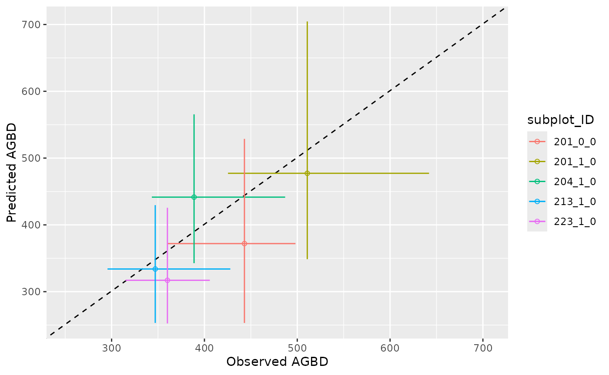

Uncertainties on the prediction are represented by the vertical
segments, while the original uncertainties on data, namely subplot level
AGBD, are represented by the horizontal segments, the black dotted line
is the identity line. When you are good with your validation results,
you infer the model **with the entire dataset**, and then predict a
robust AGBD map.

Let’s keep in mind that in this vignette example we are working with a
very small number of inventory plots: we lack of data to get robust AGBD
map predictions, and properly conduct the validation step. But we
encourage BIOMASS users to run that validation procedure, or another one
that is suitable to your data!
