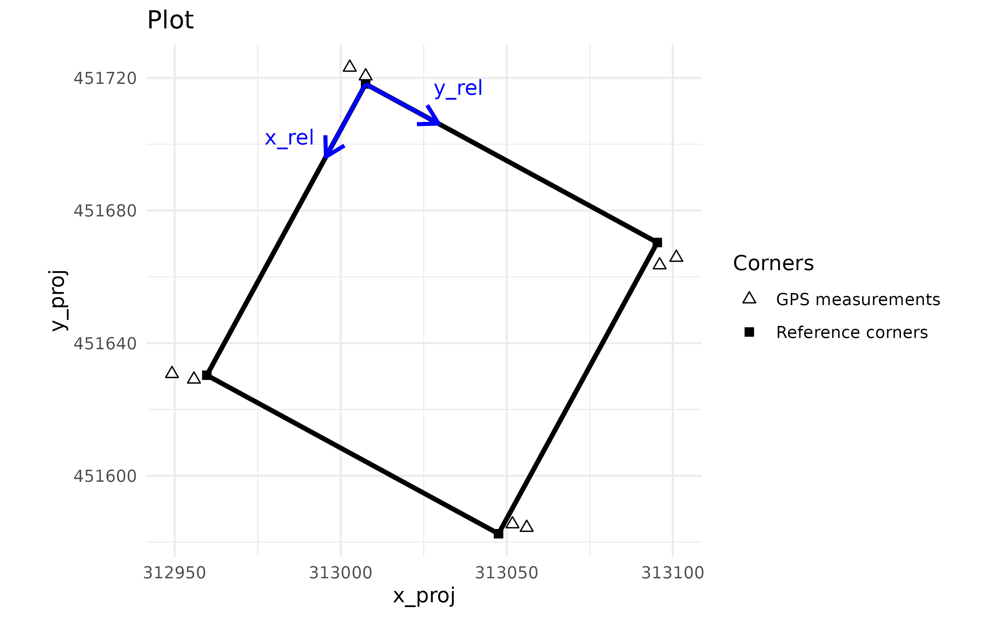
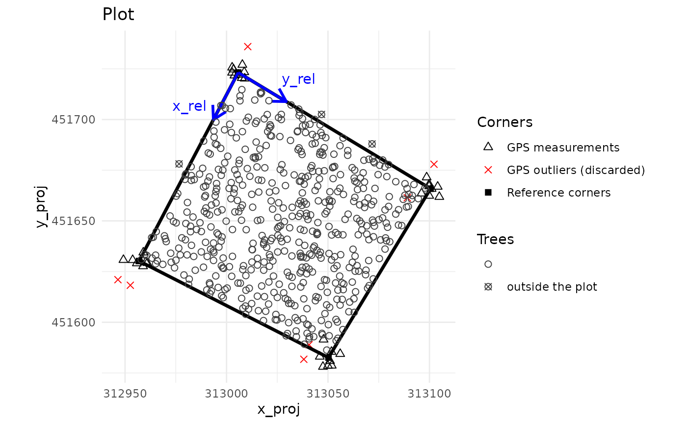
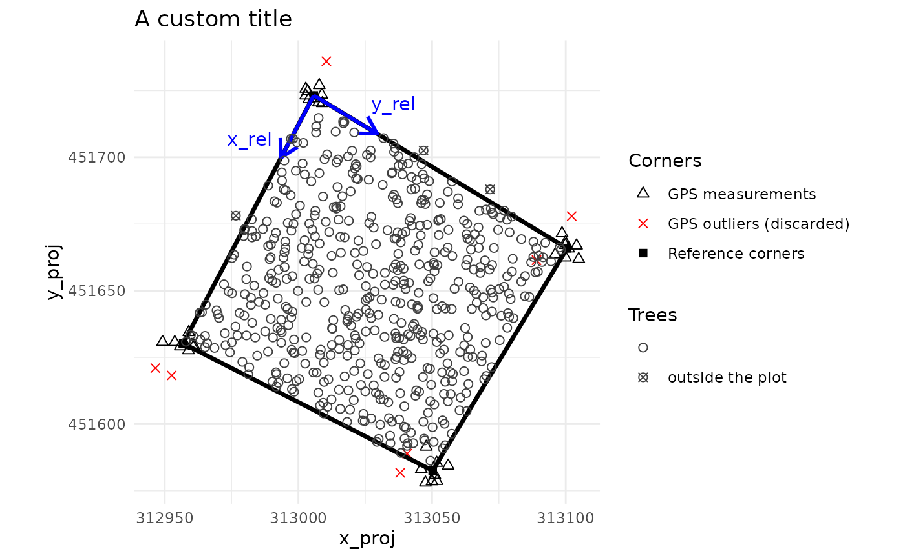
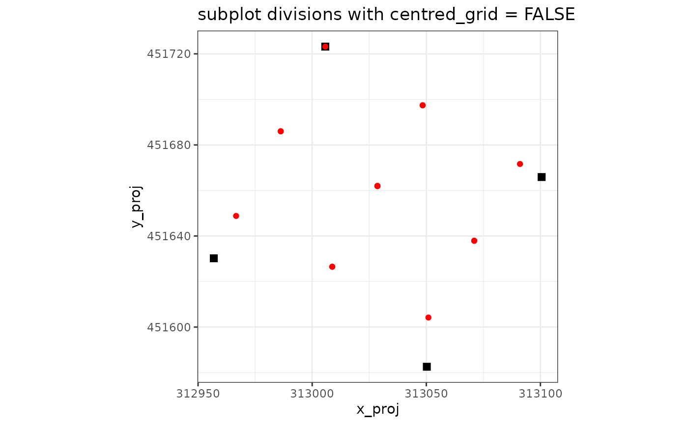
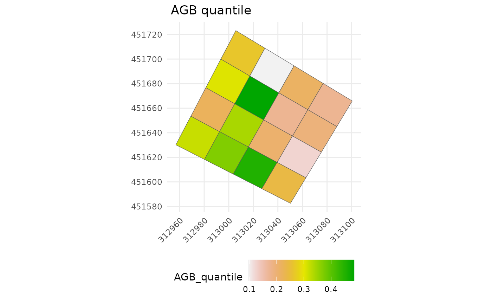
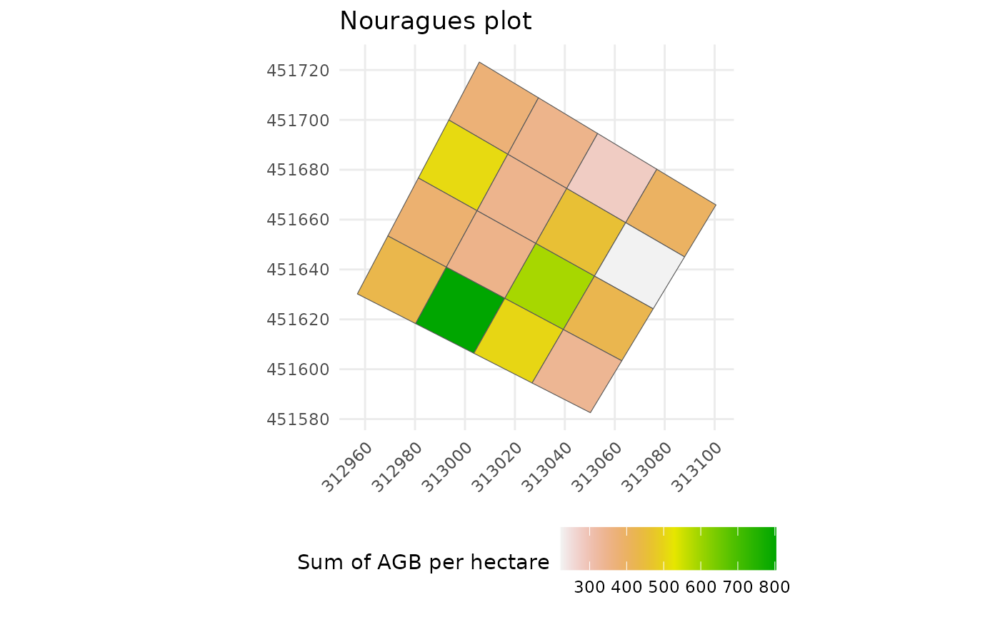
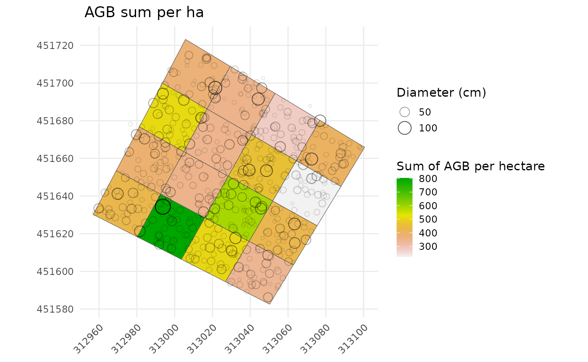

# Spatialize trees and forest stand metrics with BIOMASS

## Overview

BIOMASS enables users to manage their plots by:

- calculating the projected/geographic coordinates of the plot’s corners
  and the trees from the relative coordinates (or local coordinates,
  *i.e.* those of the field)

- visualising the plots

- validating plot’s corners and tree coordinates with LiDAR data

- dividing plots into subplots

- summarising any tree metric at subplot level

## Required data

Two data frames are required to perform the analysis. One for the corner
of the plot(s), and one for the trees, which contains at least their
coordinates.

- The **corner data frame** must contains at least:
  - the names of the corresponding plots if there are several plots
    (below referred as to the ‘Plot’ column)
  - the coordinates of the plot’s corners in the **geographic or
    projected coordinate system** (the GPS coordinates, below referred
    as to the ‘Xutm’ and ‘Yutm’ columns)
  - the coordinates of the plot’s corners in the **plot’s relative
    coordinate system** (the local or field coordinates, below referred
    as to the ‘Xfield’ and ‘Yfield’ columns)

In this vignette, for educational purpose, we will not use only one but
**two datasets of corner coordinates**, derived from permanent plots in
the [Nouragues
forest](https://dataverse.cirad.fr/dataset.xhtml?persistentId=doi:10.18167/DVN1/TZ1RL9)
(French Guiana):

1.  **NouraguesPlot201** which contains simulated corner coordinates of
    **one plot with repeated GPS measurements of each corner**:

``` r
data("NouraguesPlot201")

kable(head(NouraguesPlot201), digits = 5, row.names = FALSE, caption = "Head of NouraguesPlot201")
```

| Site          | Plot | Xfield | Yfield |     Xutm |     Yutm |      Long |     Lat |
|:--------------|-----:|-------:|-------:|---------:|---------:|----------:|--------:|
| Petit_Plateau |  201 |      0 |      0 | 313002.7 | 451723.1 | -52.68451 | 4.08504 |
| Petit_Plateau |  201 |      0 |      0 | 313007.5 | 451720.5 | -52.68446 | 4.08502 |
| Petit_Plateau |  201 |      0 |      0 | 313008.7 | 451723.4 | -52.68445 | 4.08504 |
| Petit_Plateau |  201 |      0 |      0 | 313002.8 | 451725.7 | -52.68451 | 4.08506 |
| Petit_Plateau |  201 |      0 |      0 | 313005.8 | 451722.1 | -52.68448 | 4.08503 |
| Petit_Plateau |  201 |      0 |      0 | 313010.5 | 451736.0 | -52.68444 | 4.08516 |

Head of NouraguesPlot201

2.  **NouraguesCoords** which contains corner coordinates of **four
    plots with a single GPS measurement of each corner**, also derived
    from Nouragues forest:

``` r
data("NouraguesCoords")

kable(head(NouraguesCoords), digits = 5, row.names = FALSE, caption = "Head of NouraguesCoords")
```

| Site          | Plot | Xfield | Yfield |     Xutm |     Yutm |      Long |     Lat |
|:--------------|-----:|-------:|-------:|---------:|---------:|----------:|--------:|
| Petit_Plateau |  201 |      0 |      0 | 313007.9 | 451717.2 | -52.68446 | 4.08499 |
| Petit_Plateau |  201 |      0 |    100 | 313095.8 | 451669.5 | -52.68367 | 4.08456 |
| Petit_Plateau |  201 |    100 |      0 | 312960.2 | 451629.3 | -52.68489 | 4.08419 |
| Petit_Plateau |  201 |    100 |    100 | 313048.0 | 451581.6 | -52.68410 | 4.08376 |
| Petit_Plateau |  204 |      0 |    300 | 313271.5 | 451574.0 | -52.68208 | 4.08370 |
| Petit_Plateau |  204 |      0 |    400 | 313359.4 | 451526.3 | -52.68129 | 4.08327 |

Head of NouraguesCoords

- The data frame including the **tree coordinates**, must contain at
  least:
  - the name of the plots if there are several plots
  - the tree coordinates in the plot’s relative coordinate system (the
    local/field one)
  - the desired information about trees, such as diameter, wood density,
    height, AGB, etc. (see BIOMASS vignette)

``` r
data("NouraguesTrees")

kable(head(NouraguesTrees), digits = 3, row.names = FALSE, caption = "Head of the table trees")
```

| Site          | Plot | Xfield | Yfield | Family        | Genus               | Species     |    D |
|:--------------|-----:|-------:|-------:|:--------------|:--------------------|:------------|-----:|
| Petit_Plateau |  201 |    0.0 |   31.5 | Burseraceae   | Protium             | surinamense | 11.0 |
| Petit_Plateau |  201 |    0.1 |   75.2 | Anacardiaceae | Tapirira            | guianensis  | 74.4 |
| Petit_Plateau |  201 |    0.2 |   27.6 | Lecythidaceae | Indet.Lecythidaceae | Indet.      | 25.4 |
| Petit_Plateau |  201 |   -4.0 |   67.5 | Euphorbiaceae | Conceveiba          | guyanensis  | 10.0 |
| Petit_Plateau |  201 |    0.3 |   39.9 | Burseraceae   | Protium             | altissimum  | 18.9 |
| Petit_Plateau |  201 |   -3.5 |   41.5 | Euphorbiaceae | Mabea               | speciosa    | 10.0 |

Head of the table trees

This dataset is also derived from the [2012 Nouragues forest
dataset](https://dataverse.cirad.fr/dataset.xhtml?persistentId=doi:10.18167/DVN1/TZ1RL9),
but for educational purpose, some virtual trees with erroneous
coordinates have been added in the data.

## Checking plot’s coordinates

Two situations may occur:

- The **GPS coordinates** of the plot corners are considered **very
  accurate** or **enough measurements have been made** to be confident
  in the accuracy of their average. In this case, the shape of the plot
  measured on the field will follow the GPS coordinates of the plot
  corners when projected into the projected/geographic coordinate
  system. See [3.1.1](#trustGSPcorner)

- **Too few measurements of the GPS coordinates** of plot corners have
  been collected and/or are **not reliable**. In this case, **the shape
  of the plot measured on the field is considered to be accurate** and
  the GPS corner coordinates will be recalculated to fit the shape and
  dimensions of the plot. See [3.1.2](#trustPlotShape)

In both cases, the use of the
[`check_plot_coord()`](https://umr-amap.github.io/BIOMASS/reference/check_plot_coord.md)
function is recommended as a first step.

### Checking the corners of the plot

The
[`check_plot_coord()`](https://umr-amap.github.io/BIOMASS/reference/check_plot_coord.md)
function handles both situations using the `trust_GPS_corners` argument
(= TRUE or FALSE).

You can give either geographical coordinates with the ‘longlat’ argument
or another projected coordinates with the ‘proj_coord’ argument for the
corner coordinates.

#### If we rely on the GPS coordinates of the corners:

- When only **1 GPS measurement by corner** has been recorded **with a
  high degree of accuracy** (by a geometer, for example), or if you
  already have averaged your measurements by yourself, you can supply
  these 4 GPS coordinates to the function.

- When **enough coordinates have been recorded for each corner** (for
  more information, see the [CEOS good practices protocol, section
  A.1.3.1](https://lpvs.gsfc.nasa.gov/PDF/CEOS_WGCV_LPV_Biomass_Protocol_2021_V1.0.pdf)
  ), the coordinates will be averaged by corner, resulting in 4
  reference coordinates. The function can also detect and remove GPS
  outliers using the ‘rm_outliers’ and ‘max_dist’ arguments.

``` r
check_plot_trust_GPS <- check_plot_coord(
  corner_data = NouraguesPlot201,
  longlat = c("Long", "Lat"),  # or proj_coord = c("Xutm", "Yutm"), 
  rel_coord = c("Xfield", "Yfield"),
  trust_GPS_corners = T,
  draw_plot = TRUE,
  max_dist = 10, rm_outliers = TRUE)
```


The two blue arrows represent the origin of the plot’s relative
coordinate system.

#### If we rely on the shape of the plot measured on the field:

Let’s degrade the data to mimic the case where we only have 8 unreliable
GPS coordinates.

``` r
degraded_corner_coord <- NouraguesPlot201[c(1:2,11:12,21:22,31:32),]

check_plot_trust_field <- check_plot_coord(
  corner_data = degraded_corner_coord,
  longlat = c("Long", "Lat"),  # or proj_coord = c("Xutm", "Yutm"), 
  rel_coord = c("Xfield", "Yfield"),
  trust_GPS_corners = FALSE,
  draw_plot = TRUE, rm_outliers = FALSE)
#>  Be carefull, you may have GNSS measurement outliers. 
#>  Removing them may improve the georeferencing of your plot (see rm_outliers and max_dist arguments).
```



We can see that the corners of the plot do not match the GPS
measurements. In fact, they correspond to the best compromise between
the shape and dimensions of the plot and the GPS measurements.

### Recovering reference corner coordinates and the associated polygon(s)

Reference corner coordinates are returned by the function via the
`$corner_coord` output, with standardised column names for future data
processing.

``` r
kable(check_plot_trust_GPS$corner_coord, row.names = FALSE, caption = "Reference corner coordinates")
```

| x_rel | y_rel |   x_proj |   y_proj |      long |      lat |
|------:|------:|---------:|---------:|----------:|---------:|
|     0 |     0 | 313005.7 | 451723.2 | -52.68448 | 4.085040 |
|   100 |     0 | 312956.9 | 451630.2 | -52.68492 | 4.084198 |
|   100 |   100 | 313050.2 | 451582.6 | -52.68408 | 4.083769 |
|     0 |   100 | 313100.5 | 451665.9 | -52.68363 | 4.084524 |

Reference corner coordinates

The associated polygon is returned via the `$polygon` output and can be
saved into a shapefile as follows:

``` r
sf::st_write(check_plot_trust_GPS$polygon, "your_directory/plot201.shp")
```

For full details, the `$outlier_corners` output returns all the
information about GPS outliers found by the function, the `$UTM_code`
output returns the UTM code calculated by the function if geographic
coordinates have been provided, and the `$sd_coord` output returns the
average standard deviation of the GPS measurements for each corner on
the X and Y axes.

### Visualising and retrieving projected tree coordinates

Tree coordinates are usually measured in the plot’s relative coordinate
system. To project them in the projected/GPS system, you can supply
their relative coordinates using the `tree_data` and `tree_coords`
arguments.

``` r
plot201Trees <- NouraguesTrees[NouraguesTrees$Plot==201,]

check_plot_trust_GPS <- check_plot_coord(
  corner_data = NouraguesPlot201,
  longlat = c("Long", "Lat"), rel_coord = c("Xfield", "Yfield"),
  trust_GPS_corners = TRUE,
  tree_data = plot201Trees, tree_coords = c("Xfield","Yfield"))
#>  Be careful, one or more trees are not inside the plot defined by rel_coord (see is_in_plot column of tree_data output)
```



The projected/GPS coordinates of the trees are added to the tree
data-frame and returned by the output `$tree_data` (columns x_proj/long
and y_proj/lat).

``` r
kable(head(check_plot_trust_GPS$tree_data[,-c(5,6,7)]), digits = 3, row.names = FALSE, caption = "Head of the $tree_data output")
```

| Site          | Plot | x_rel | y_rel |    D |   x_proj |   y_proj | is_in_plot |    long |   lat |
|:--------------|-----:|------:|------:|-----:|---------:|---------:|:-----------|--------:|------:|
| Petit_Plateau |  201 |   0.0 |  31.5 | 11.0 | 313035.6 | 451705.1 | TRUE       | -52.684 | 4.085 |
| Petit_Plateau |  201 |   0.1 |  75.2 | 74.4 | 313077.0 | 451680.0 | TRUE       | -52.684 | 4.085 |
| Petit_Plateau |  201 |   0.2 |  27.6 | 25.4 | 313031.8 | 451707.2 | TRUE       | -52.684 | 4.085 |
| Petit_Plateau |  201 |  -4.0 |  67.5 | 10.0 | 313071.7 | 451688.0 | FALSE      | -52.684 | 4.085 |
| Petit_Plateau |  201 |   0.3 |  39.9 | 18.9 | 313043.4 | 451700.1 | TRUE       | -52.684 | 4.085 |
| Petit_Plateau |  201 |  -3.5 |  41.5 | 10.0 | 313046.8 | 451702.5 | FALSE      | -52.684 | 4.085 |

Head of the \$tree_data output

The output of the function also standardises the names of the relative
tree coordinates (to `x_rel` and `y_rel`) and adds the `is_in_plot`
column, indicating if a tree is in the plot or not.

If you have a shapefile containing useful information about the plot,
you can also display it using the `shapefile` argument.

Finally, you can access and modify the plot via the `$plot_design`
output which is a ggplot object. For example, to change the plot title:

``` r
plot_to_change <- check_plot_trust_GPS$plot_design
plot_to_change <- plot_to_change + ggtitle("A custom title")
plot_to_change
```



### Integrating LiDAR data

If you have LiDAR data in raster format (typically a CHM raster) that
you want to compare with a tree metric, this can be done with the
`ref_raster`, `prop_tree` and `threshold_tree` arguments.

``` r
# Load internal CHM raster
nouraguesRaster <- terra::rast(system.file("extdata", "NouraguesRaster.tif",package = "BIOMASS", mustWork = TRUE))

check_plot_trust_GPS <- check_plot_coord(
  corner_data = NouraguesPlot201,
  longlat = c("Long", "Lat"), rel_coord = c("Xfield", "Yfield"),
  trust_GPS_corners = TRUE,
  tree_data = plot201Trees, tree_coords = c("Xfield","Yfield"),
  prop_tree = "D", threshold_tree = 20, # Display tree diameters >= 20
  ref_raster = nouraguesRaster )
#>  Be careful, one or more trees are not inside the plot defined by rel_coord (see is_in_plot column of tree_data output)
```


### Checking multiple plots at once

When `corner_data` and `tree_data` contain several plots, you have to
supply the column names containing the plots IDs of the corners and the
trees via the `plot_ID` and `tree_plot_ID` arguments:

``` r
multiple_checks <- check_plot_coord(
  corner_data = NouraguesCoords, # NouraguesCoords contains 4 plots
  proj_coord = c("Xutm", "Yutm"), rel_coord = c("Xfield", "Yfield"),
  trust_GPS_corners = TRUE, 
  plot_ID = "Plot",
  tree_data = NouraguesTrees, tree_coords = c("Xfield","Yfield"), 
  prop_tree = "D", tree_plot_ID = "Plot",
  ref_raster = nouraguesRaster)
#> In plot 201 : Be careful, one or more trees are not inside the plot defined by rel_coord (see is_in_plot column of tree_data output)
#> In plot 213 : Be careful, one or more trees are not inside the plot defined by rel_coord (see is_in_plot column of tree_data output)
#> In plot 223 : Be careful, one or more trees are not inside the plot defined by rel_coord (see is_in_plot column of tree_data output)
```


Be aware that by default, the function will ask you to type Enter
between each plot (argument ‘ask = TRUE’).

## Dividing plots

Dividing plots into several sub-plots is performed using the
[`divide_plot()`](https://umr-amap.github.io/BIOMASS/reference/divide_plot.md)
function. This function takes the relative coordinates of the 4 corners
of the plot to divide it into a grid. Be aware that **the plot must be
rectangular in the plot’s relative coordinates system**, *i.e.* have 4
right angles:

``` r
subplots <- divide_plot(
  corner_data = check_plot_trust_GPS$corner_coord,
  rel_coord = c("x_rel","y_rel"),
  proj_coord = c("x_proj","y_proj"),
  grid_size = 25 # or c(25,25)
  )

kable(head(subplots$sub_corner_coord, 10), digits = 1, row.names = FALSE, caption = "Head of the divide_plot()$sub_corner_coord output.")
```

| plot_ID | subplot_ID  | x_rel | y_rel |   x_proj |   y_proj |
|:--------|:------------|------:|------:|---------:|---------:|
|         | subplot_0_0 |     0 |     0 | 313005.7 | 451723.2 |
|         | subplot_0_0 |    25 |     0 | 312993.5 | 451699.9 |
|         | subplot_0_0 |    25 |    25 | 313017.1 | 451686.2 |
|         | subplot_0_0 |     0 |    25 | 313029.4 | 451708.9 |
|         | subplot_1_0 |    25 |     0 | 312993.5 | 451699.9 |
|         | subplot_1_0 |    50 |     0 | 312981.3 | 451676.7 |
|         | subplot_1_0 |    50 |    25 | 313004.8 | 451663.6 |
|         | subplot_1_0 |    25 |    25 | 313017.1 | 451686.2 |
|         | subplot_2_0 |    50 |     0 | 312981.3 | 451676.7 |
|         | subplot_2_0 |    75 |     0 | 312969.1 | 451653.5 |

Head of the divide_plot()\$sub_corner_coord output.

If you want to stay in the plot’s relative coordinate system, just set
`proj_coord` = NULL.

The function also handles imperfect cuts with the `origin` and
`grid_tol` arguments. Here an example with a 40mx45m grid and origin
coordinates set at (10 ; 5).

``` r
subplots <- divide_plot(
  corner_data = check_plot_trust_GPS$corner_coord, 
  rel_coord = c("x_rel","y_rel"), proj_coord = c("x_proj","y_proj"),
  grid_size = c(40,45), 
  grid_tol = 0.3, # by default =0.1, ie, if more than 10% of the plot is not covered by the grid, it will returned an error
  origin = c(10,5)
  )
#> Warning in divide_plot_fct(.SD, grid_size, origin): 
#> The x-dimension of the plot is not a multiple of the x-dimension of the grid size and origin offset
#> Warning in divide_plot_fct(.SD, grid_size, origin): 
#> The y-dimension of the plot is not a multiple of the y-dimension of the grid size and origin offset
```



For the purpose of summarising and representing subplots (coming in the
next section), the function returns the coordinates of subplot corners
but can also **assign to each tree its subplot** with the **`tree_data`
and `tree_coords` arguments**:

``` r
# Add AGB predictions (calculated in Vignette BIOMASS) to plot201Trees
AGB_data <- readRDS("saved_data/NouraguesTreesAGB.rds")
plot201Trees <- merge(plot201Trees , AGB_data[c("Xfield","Yfield","D","AGB")], sort=FALSE)

subplots <- divide_plot(
  corner_data = check_plot_trust_GPS$corner_coord, 
  rel_coord = c("x_rel","y_rel"),
  proj_coord = c("x_proj","y_proj"),
  grid_size = 25, # or c(25,25)
  tree_data = plot201Trees, tree_coords = c("Xfield","Yfield")
  )
#> Warning in divide_plot(corner_data = check_plot_trust_GPS$corner_coord, : One
#> or more trees could not be assigned to a subplot (not in a subplot area)
```

The function now returns a list containing:

- `sub_corner_coord`: coordinates of subplot corners as previously

- `tree_data`: the tree data-frame with the **subplot_ID added in last
  column**

``` r
kable(head(subplots$tree_data[,-c(2,3,4)]), digits = 1, row.names = FALSE, caption = "Head of the divide_plot()$tree_data returns")
```

| x_rel | Plot | Family        | Genus               | Species     | AGB | plot_ID | subplot_ID  |
|------:|-----:|:--------------|:--------------------|:------------|----:|:--------|:------------|
|   0.0 |  201 | Burseraceae   | Protium             | surinamense | 0.1 |         | subplot_0_1 |
|   0.1 |  201 | Anacardiaceae | Tapirira            | guianensis  | 7.3 |         | subplot_0_3 |
|   0.2 |  201 | Lecythidaceae | Indet.Lecythidaceae | Indet.      | 0.6 |         | subplot_0_1 |
|  -4.0 |  201 | Euphorbiaceae | Conceveiba          | guyanensis  | 0.1 |         | NA          |
|   0.3 |  201 | Burseraceae   | Protium             | altissimum  | 0.3 |         | subplot_0_1 |
|  -3.5 |  201 | Euphorbiaceae | Mabea               | speciosa    | 0.1 |         | NA          |

Head of the divide_plot()\$tree_data returns

Of course, the function can handle as many plots as you want, using the
`corner_plot_ID` and `tree_plot_ID` arguments:

``` r
multiple_subplots <- divide_plot(
  corner_data = NouraguesCoords,
  rel_coord = c("Xfield","Yfield"), proj_coord = c("Xutm","Yutm"), corner_plot_ID = "Plot",
  grid_size = 25, 
  tree_data = NouraguesTrees, tree_coords = c("Xfield","Yfield"), tree_plot_ID = "Plot"
)
#> Warning in divide_plot(corner_data = NouraguesCoords, rel_coord = c("Xfield", :
#> One or more trees could not be assigned to a subplot (not in a subplot area)
```

Last but not least, the function can account for uncertainty in the
corner coordinates using the `sd_coord` and `n` arguments. In this case,
`n` simulations of corner positioning will be drawn and returned via the
`$simu_coord` output list. The uncertainty (sd) on each corner position
along the X- and Y- axis will be equal to the value of sd_coord:

``` r
sd_coord_subplots <- divide_plot(
  corner_data = check_plot_trust_GPS$corner_coord,
  rel_coord = c("x_rel","y_rel"),
  proj_coord = c("x_proj","y_proj"),
  grid_size = 25, # or c(25,25)
  tree_data = plot201Trees, tree_coords = c("Xfield","Yfield"),
  sd_coord = check_plot_trust_GPS$sd_coord, n = 50
  )
#> Warning in divide_plot(corner_data = check_plot_trust_GPS$corner_coord, : One
#> or more trees could not be assigned to a subplot (not in a subplot area)
```

## Summarising metrics at subplot level

### Summarising tree metrics

Once you’ve applied the
[`divide_plot()`](https://umr-amap.github.io/BIOMASS/reference/divide_plot.md)
function with a non-null `tree_data` argument, you can summarise any
tree metric at the subplot level with the
[`subplot_summary()`](https://umr-amap.github.io/BIOMASS/reference/subplot_summary.md)
function.

``` r
subplot_metric <- subplot_summary(
  subplots = subplots,
  value = "AGB", # AGB was added before applying divide_plot()
  per_ha = TRUE) 
#> [[1]]
```


**By default, the function sums the metric per subplot** and divides the
result by the area of each subplot (to obtain a summary **per
hectare**), but you can request any valid function using `fun` argument
and choose between a raw or a per hectare summary using `per_ha`
argument.

``` r
subplot_metric <- subplot_summary(
  subplots = subplots,
  value = "AGB",
  fun = quantile, probs = 0.5, # yes, it is the median
  per_ha = FALSE)
#> [[1]]
```



The output of the function is a list containing:

- `$tree_summary`: a summary of the metric per subplot

- `$polygon`: a simple feature collection of the summarised subplot’s
  polygons

- `$plot_design`: a ggplot object that can easily be modified

The returned **polygons can be saved into a shapefile** like this:

``` r
# Set the CRS of the polygons
subplot_polygons <- sf::st_set_crs(
  subplot_metric$polygon ,
  value = "EPSG:2972") # EPSG:2972 (corresponding to UTM Zone 22N) is the UTM coordinate system of Nouragues

# Save the polygons in a shapefile
sf::st_write(subplot_polygons, "your_directory/subplots_201.shp")
```

And of course, the function can handle **as many plots as provided in
divide_plot()**:

``` r
multiple_subplot_metric <- subplot_summary(
  subplots = multiple_subplots, draw_plot = FALSE,
  value = "D", fun = mean, per_ha = FALSE)
```

### Summarising the AGBD and its uncertainties

If you have obtained the **AGB estimates and their uncertainty using the
‘AGBmonteCarlo()’** function (see the [Estimating stand biomass
vignette](https://umr-amap.github.io/BIOMASS/articles/Vignette_BIOMASS.html#some-tricks),
you can provide the output matrix of this function using the `AGB_simu`
argument.  
The function also handles uncertainty in corner coordinates if the
`subplots` argument provided has been created using the `sd_coord`
argument (optional):

``` r
subplot_AGBD <- subplot_summary(
  subplots = sd_coord_subplots,
  AGB_simu = error_prop$AGB_simu # error_prop has been created in the previous vignette
)
#> As 'AGB_simu' contains 200 simulations, and 'subplots$simu_coord' contains 50 simulations, 150 simulations will be resampled in 'subplots'.
#> [[1]]
```


The simulated AGBs are therefore summarised in **AGBD** (i.e. AGB per
hectare), and the function returns an additional output containing all
the simulations performed: `$long_AGB_simu`.

### Summarising LiDAR metrics

[`subplot_summary()`](https://umr-amap.github.io/BIOMASS/reference/subplot_summary.md)
can also **summarise the metric contained in a raster** (typically a CHM
raster obtained from LiDAR data) by providing the `ref_raster` and the
`raster_fun` arguments:

``` r
raster_summary <- subplot_summary(
  subplots = subplots,
  ref_raster = nouraguesRaster, raster_fun = median)
#> Extracting raster metric...Extracting raster metric done.
#> [[1]]
```


### All at once

Let us consider the uncertainty in the coordinates of the plot corners
and summarise the following information:

- the standard deviation of diameter
- the AGB and its uncertainty
- the mean raster values

``` r
subplot_metric <- subplot_summary(
  subplots = sd_coord_subplots,
  value = "D", fun = sd, per_ha = TRUE,
  AGB_simu = error_prop$AGB_simu, 
  ref_raster = nouraguesRaster # by default, the associated function is the mean function
  )
#> As 'AGB_simu' contains 200 simulations, and 'subplots$simu_coord' contains 50 simulations, 150 simulations will be resampled in 'subplots'.
#> Extracting raster metric...Extracting raster metric done.
#> [[1]]
```


    #> 
    #> [[2]]


    #> 
    #> [[3]]


### Customizing the ggplot

Here are some examples to custom the ggplot of the
[`subplot_summary()`](https://umr-amap.github.io/BIOMASS/reference/subplot_summary.md)
function:

``` r
subplot_metric <- subplot_summary(subplots = subplots,
                                  value = "AGB") 
#> [[1]]
```


``` r

custom_plot <- subplot_metric$plot_design
# Change the title and legend:
custom_plot + 
  labs(title = "Nouragues plot" , fill="Sum of AGB per hectare")
```



``` r
# Display trees with diameter as size and transparency (and a smaller legend on the right): 
custom_plot + 
  geom_point(data=check_plot_trust_GPS$tree_data, mapping = aes(x = x_proj, y = y_proj, size = D, alpha= D), shape=1,) +
  labs(fill = "Sum of AGB per hectare") +
  guides(alpha = guide_legend(title = "Diameter (cm)"),
         size = guide_legend(title = "Diameter (cm)")) + 
  theme(legend.position = "right", legend.key.size = unit(0.5, 'cm'))
```


