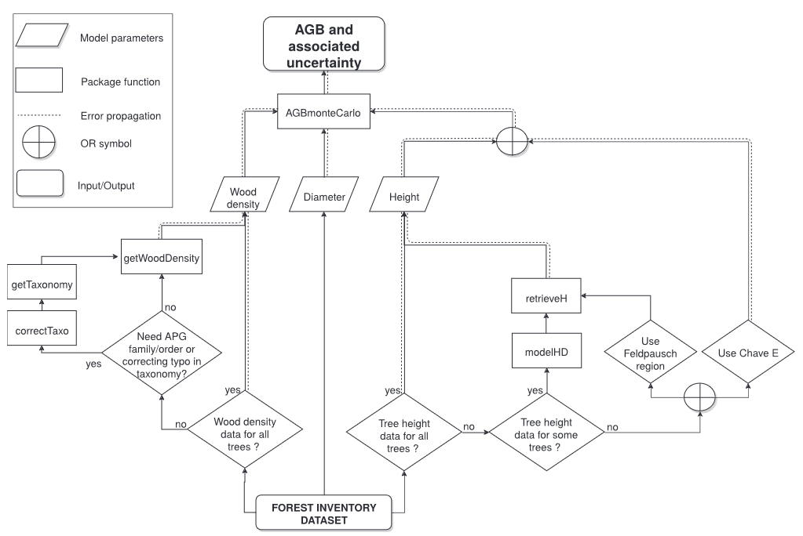

```{r setup, include=FALSE}
knitr::opts_chunk$set(
  collapse = TRUE, echo = TRUE,
  comment = "#>", fig.align = "center")
require(knitr)
require(BIOMASS)
```

# General workflow and required data

For the sake of clarity, and to be consistent with the BIOMASS paper ([Réjou-Méchain et al. 2017](https://besjournals.onlinelibrary.wiley.com/doi/10.1111/2041-210X.12753)), this vignette follows the same workflow as presented in the paper:



As can be seen, the **estimate of the above ground biomass** (AGB) of a tree, and **its associated uncertainty**, is based on its **wood density**, **diameter**, and **height**.

However, exhaustive values of **wood density** and **height** are rarely available in forest inventory data. This is why the package proposes an estimate of these two covariables, based on more usual data.

In this vignette, we will use some of the data obtained in 2012 from a [forest inventory](https://dataverse.cirad.fr/dataset.xhtml?persistentId=doi:10.18167/DVN1/TZ1RL9) conducted in 2012 in the Nouragues forest (French Guiana). For educational purpose, some virtual trees have been added to the data.

```{r load_NouraguesTrees}
data("NouraguesTrees")
knitr::kable(head(NouraguesTrees))
```

These data do not contain any information on wood density or height of trees. Only diameter is known, as no estimate can be made without this information.

# Wood density 

**Wood density** is estimated **from tree taxonomy**, using the [global wood density database](https://datadryad.org/stash/dataset/doi:10.5061/dryad.234) as a reference. So the first step might be to correct tree taxonomy.

## Checking and retrieving tree taxonomy

This is done with the `correctTaxo()` function, but before calling it, let's speak about cache !

When the function is called for the first time with the argument `useCache = TRUE`, a temporary file containing the request to [TNRS](https://tnrs.biendata.org/) will be automatically created in an existing folder. Once this has been done, during the current session **the use of `useCache = TRUE` will access the saved temporary file** in order to avoid time-consuming replication of server requests. But **by quitting the current R session, this temporary file will be removed**. So before calling `correctTaxo()`, we advise you to define a folder which will host the cache file permanently, enabling to work offline.

```{r, eval=FALSE}
# By default
createCache() 
# Or if you want to set your own cache folder
createCache("the_path_to_your_cache_folder") 
# Or 
options("BIOMASS.cache" = "the_path_to_your_cache_folder")

```

That said, let's continue with the call to `correctTaxo()` function:

```{r save_correctTaxo, eval=FALSE}
Taxo <- correctTaxo(
  genus = NouraguesTrees$Genus, # genus also accepts the whole species name (genus + species) or (genus + species + author) 
  species = NouraguesTrees$Species, 
  useCache = TRUE, verbose = FALSE)
saveRDS(Taxo, file = "saved_data/Taxo_vignette.rds")
```

```{r load_correctTaxo, include=FALSE}
Taxo <- readRDS(file = "saved_data/Taxo_vignette.rds")
```

The corrected genus and species of the trees can now be added to the data: 

```{r corrected_taxo}
NouraguesTrees$GenusCorrected <- Taxo$genusCorrected
NouraguesTrees$SpeciesCorrected <- Taxo$speciesCorrected
```

Here, as an example, the species name of the fourth tree has been corrected from "guyanensis" to "guianensis" (the fourth row of correctTaxo() output has a TRUE value for the column nameModified) : 

```{r species_correction_example}
NouraguesTrees$Species[4]
Taxo[4,]
```

If you want (but this is optional for the rest), you can retrieve APG III families and orders from genus names.

```{r getTaxonomy, eval=FALSE}
APG <- getTaxonomy(NouraguesTrees$GenusCorrected, findOrder = TRUE)
NouraguesTrees$familyAPG <- APG$family
NouraguesTrees$orderAPG <- APG$order
```

## Getting wood density

Wood densities are retrieved using `getWoodDensity()` function. By default, this function assigns to each taxon a species- or genus-level average if at least one wood density value of the same species or genus is available in the reference database. For unidentified trees or if the genus is missing in the reference database, the stand-level mean wood density is assigned to the tree.

```{r getWoodDensity}
wood_densities <- getWoodDensity(
  genus = NouraguesTrees$GenusCorrected,
  species = NouraguesTrees$SpeciesCorrected,
  stand = NouraguesTrees$Plot # for unidentified or non-documented trees in the reference database
)

NouraguesTrees$WD <- wood_densities$meanWD
```

For information, here are the number of wood density values estimated at the species, genus and plot level:
```{r wd_informations}
# At species level
sum(wood_densities$levelWD == "species")
# At genus level
sum(wood_densities$levelWD == "genus")
# At plot level
sum(!wood_densities$levelWD %in% c("genus", "species"))
```

The `family` argument also assigns to the trees a family-level wood density average, but bear in mind that the taxon-average approach gives relatively poor estimates above the genus level (Flores & Coomes 2011).

**Additional wood density values can be added** using the `addWoodDensityData` argument (here invented for the example):

```{r LocalWoodDensity, eval=FALSE}
LocalWoodDensity <- data.frame(
  genus = c("Paloue", "Handroanthus"),
  species = c("princeps", "serratifolius"),
  wd = c(0.65, 0.72) )

add_wood_densities <- getWoodDensity(
  genus = NouraguesTrees$GenusCorrected,
  species = NouraguesTrees$SpeciesCorrected,
  family = NouraguesTrees$familyAPG,
  stand = NouraguesTrees$Plot,
  addWoodDensityData = LocalWoodDensity
)
```

# Height

As tree height measurements are rare, or rarely exhaustive, BIOMASS proposes three methods to estimate tree height: 

If a subset of well-measured trees is available in the studied region: 

- Construct a local Height–Diameter (H-D) allometry

If not: 

- Use the continent- or region-specific H–D models proposed by [Feldpausch et al. (2012)](https://bg.copernicus.org/articles/9/3381/2012/)
- Use a generic H–D model based on a single bioclimatic predictor E (eqn 6a in [Chave et al. 2014](https://onlinelibrary.wiley.com/doi/abs/10.1111/gcb.12629))

## Building a local H-D model

As no height was measured in our dataset, we will use the `NouraguesHD` dataset, which contains the height and diameter measurements of two 1-ha plots from the Nouragues forest.

```{r load_NouraguesHD}
data("NouraguesHD")
```

The `modelHD()` function is used to either **compare four implemented models to fit H–D relationships** in the tropics, or to **compute the desired H-D model**.

Here we first compare the four H-D models:

```{r multiple_modelHD, message=FALSE}
HD_res <- modelHD(
  D = NouraguesHD$D, H = NouraguesHD$H,
  useWeight = TRUE, drawGraph = T)

kable(HD_res)
```

As the log2 model has the lowest RSE, we build this model using the `method` argument and add its predictions to the dataset with the `retrieveH()` function:

```{r log2_modelHD}
HDmodel <- modelHD(
  D = NouraguesHD$D, H = NouraguesHD$H,
  method = "log2", useWeight = TRUE)

H_model <- retrieveH(
  D = NouraguesTrees$D,
  model = HDmodel)

NouraguesTrees$H_model <-  H_model$H
```

Note that we could have created a model for each stand present in NouraguesHD data using the `plot` argument.

## Using the continent- or region-specific H–D model (Feldpausch)

No need to compute any model here, as the predictions of the model proposed by Feldspausch et al. are directly retrieved by the `retrieveH()` function. Simply indicate the region concerned:

```{r retrieveH_feldspausch}
H_feldspausch <- retrieveH(
  D = NouraguesTrees$D,
  region = "GuianaShield")

NouraguesTrees$H_feldspausch <- H_feldspausch$H
```

Available regions are listed in the documentation of the function. 

## Using the generic H–D model based on a bioclimatic predictor (Chave)

In the same way as for the previous model, the predictions of the model proposed by Chave et al. are directly retrieved by the `retrieveH()` function. Coordinates of the plot (or trees) in a longitude/latitude format must be provided.

```{r retrieveH_chave, eval=FALSE}
data("NouraguesCoords") #contains corner coordinates
coords <- apply(NouraguesCoords[c("Long","Lat")] , 2, mean) # compute the mean of the corner coordinates

H_chave  <- retrieveH(
  D = NouraguesTrees$D,
  coord = coords)

NouraguesTrees$H_chave <- H_chave$H
```

# Estimate AGB

Once tree diameter, wood density and height have been retrieved, the generalised allometric model (eqn 4
of [Chave et al. (2014)](https://onlinelibrary.wiley.com/doi/abs/10.1111/gcb.12629)) can be used with the `computeAGB()` function, where AGB values are reported in Mg instead of in kg:

```{r computeAGB}
NouraguesTrees$AGB <- computeAGB(
  D = NouraguesTrees$D,
  WD = NouraguesTrees$WD,
  H = NouraguesTrees$H_model #here with the local H-D predictions
  )
```

```{r save_AGB, include=FALSE}
#saveRDS(NouraguesTrees, file = "saved_data/NouraguesTreesAGB.rds")
```

For AGB estimates using tree heights obtained by the "Chave method" (H_chave), it is more accurate to provide the area coordinates directly instead of the tree height estimates:

```{r computAGB_chave, eval=FALSE}
NouraguesTrees$AGB_Chave <- computeAGB(
    D = NouraguesTrees$D,
    WD = NouraguesTrees$WD,
    coord = coords)
```

# Propagate AGB errors

The `AGBmonteCarlo()` function allows the user to propagate different sources of error up to the final AGB estimate.

The error propagation due to the **uncertainty of the model parameters** of the AGB allometric equation (Chave et al. 2014) **is automatically performed** by the function. However, the propagation of the error due to the **uncertainty of the model variables** (D, WD and H) can be **parameterized by the user**.

## Diameter measurement error

Using the `Dpropag` argument of the `AGBmonteCarlo()` function, the user can set diameter measurement errors by: 

- providing a standard deviation value corresponding to the measurement uncertainty (e.g `Dpropag = 1`)
- providing a vector of standard deviation values associated with each tree measurement uncertainty
- using the implemented example of Chave et al. 2004 with `Dpropag = "chave2004"`, where small errors are applied on 95% of the trees and large errors to the remaining 5%

```{r D_error_prop}
D_error_prop <- AGBmonteCarlo(
  D = NouraguesTrees$D, WD = NouraguesTrees$WD, H = NouraguesTrees$H_model,
  Dpropag = "chave2004",
  errWD = rep(0,nrow(NouraguesTrees)), errH = 0 # no error propagation on WD and H here
)
```

## Wood density error

The `getWoodDensity()` function returns prior standard deviation values associated with each tree wood density using the mean standard deviation of the [global wood density database](https://datadryad.org/stash/dataset/doi:10.5061/dryad.234) at the species, genus and family levels.

This output can be provided through the `errWD` argument:

```{r WD_error_prop}
WD_error_prop <- AGBmonteCarlo(
  D = NouraguesTrees$D, WD = NouraguesTrees$WD, H = NouraguesTrees$H_model,
  errWD = wood_densities$sdWD,
  Dpropag = 0 , errH = 0 # no error propagation on D and H here
)
```

## Height error

The user can provide either a SD value or a vector of SD values associated with tree height measurement errors, using the `errH` argument.

- **If tree heights have been estimated via the "Feldspausch" or the "Chave" method**, the user can provide the output of the `retrieveH()` function for the `errH` argument:

```{r H_feld_error_prop, eval = FALSE}
H_feld_error_prop <- AGBmonteCarlo(
  D = NouraguesTrees$D, WD = NouraguesTrees$WD, H = NouraguesTrees$H_model,
  errH = H_feldspausch$RSE,
  Dpropag = 0 , errWD = rep(0,nrow(NouraguesTrees)) # no error propagation on D and WD here
)
```

- **If tree heights have been estimated via a local HD-model**, instead of the `errH` and the `H` arguments, the user can provide the output of the `modelHD()` function using the `modelHD` argument.

```{r H_model_error_prop}
H_model_error_prop <- AGBmonteCarlo(
  D = NouraguesTrees$D, WD = NouraguesTrees$WD, # we do not provide H
  HDmodel = HDmodel, # but we provide HDmodel
  Dpropag = 0 , errWD = rep(0,nrow(NouraguesTrees)) # no error propagation on D and WD here
)
```

## All together and AGB visualisation of plots

Let's propagate all sources of errors using the HD-model:

```{r error_prop}
error_prop <- AGBmonteCarlo(
  D = NouraguesTrees$D, WD = NouraguesTrees$WD, # we do not provide H
  HDmodel = HDmodel, # but we provide HDmodel
  Dpropag = "chave2004",
  errWD = wood_densities$sdWD)

error_prop[(1:4)]
```

The first four elements of the output contain the mean, median, standard deviation and credibility intervals of the total AGB of the dataset but nothing about the AGB at the plot level. To do this, you can use the `summaryByPlot()` function:


```{r summaryByPlot}
AGB_by_plot <- summaryByPlot(AGB_val = error_prop$AGB_simu, plot = NouraguesTrees$Plot, drawPlot = TRUE)

```

Finally, the last element (`$AGB_simu`) of the `AGBmonteCarlo()` output is a matrix containing the simulated tree AGB values (in rows) for each iteration of the Monte Carlo procedure (in columns). 


# Some tricks

## Mixing measured and estimated height values

If you want to use a mix of directly-measured height and of estimated ones, you can proceed as follows:

(@) Build a vector of H and RSE where we assume an error of 0.5 m on directly measured trees

```{r tricks_Hmix, eval = FALSE }
# NouraguesHD contains 163 trees that were not measured
NouraguesHD$Hmix <- NouraguesHD$H
NouraguesHD$RSEmix <- 0.5
filt <- is.na(NouraguesHD$Hmix)
NouraguesHD$Hmix[filt] <- retrieveH(NouraguesHD$D, model = HDmodel)$H[filt]
NouraguesHD$RSEmix[filt] <- HDmodel$RSE
```

(@) Apply the AGBmonteCarlo by setting the height values and their errors (which depend on whether the trees were directly measured or estimated)
```{r tricks_Hmix_prop, eval=FALSE}
wd <- getWoodDensity(NouraguesHD$genus, NouraguesHD$species)
resultMC <- AGBmonteCarlo(
  D = NouraguesHD$D, WD = wd$meanWD, errWD = wd$sdWD,
  H = NouraguesHD$Hmix, errH = NouraguesHD$RSEmix,
  Dpropag = "chave2004"
)
summaryByPlot(AGB_val = resultMC$AGB_simu, plot = NouraguesHD$plotId, drawPlot = TRUE)
```

## Add your tricks

If you would like to share a code that might be useful to users (code authorship will be respected), you can create a new issue on the [BIOMASS github page](https://github.com/umr-amap/BIOMASS/issues), or contact Dominique (dominique.lamonica@ird.fr).
